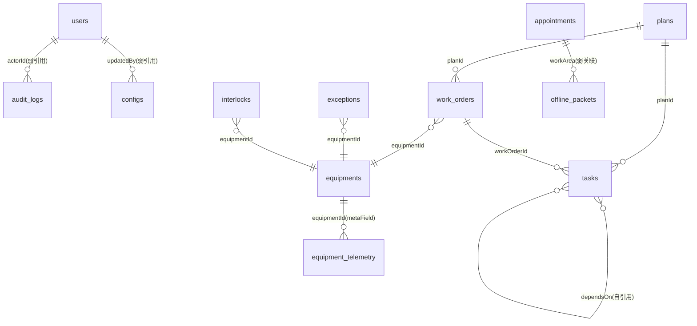

# PSMS 生产调度管理模块 —— 数据库设计文档（MongoDB 版）

| 项目 | 内容 |
|------|------|
| 文档名称 | PSMS 生产调度管理模块数据库设计文档 |
| 模块代号 | PSMS（Production Scheduling Management System） |
| 所属项目 | Project_B 数字孪生 / 综合监控一体化项目 |
| 数据库类型 | **MongoDB 7.0（文档型 / 非关系型 NoSQL）** |
| 访问层 | Mongoose 8.19.1 |
| 数据库名 | `psms` |
| 集合数量 | 12 个业务集合（含 1 个时序集合） |
| 契约基线 | 0.3.0（15 个领域对象 / 25 个接口 / 7 个场景 / 9 个错误码） |
| 文档状态 | 设计基线（已落地验证） |
| 编写日期 | 2026-09-21 |

---

## 目录

1. [文档说明](#1-文档说明)
2. [选型说明](#2-选型说明)
3. [设计规范](#3-设计规范)
4. [数据库概览](#4-数据库概览)
5. [集合详细设计](#5-集合详细设计)
6. [索引设计与典型查询](#6-索引设计与典型查询)
7. [原子性与事务](#7-原子性与事务)
8. [数据完整性与约束策略](#8-数据完整性与约束策略)
9. [TTL 与数据保留策略](#9-ttl-与数据保留策略)
10. [时序集合设计](#10-时序集合设计)
11. [容量估算与分片规划](#11-容量估算与分片规划)
12. [运维与故障处置](#12-运维与故障处置)
13. [落地验证记录](#13-落地验证记录)
14. [附录](#14-附录)

---

## 1 文档说明

### 1.1 编写目的

本文档定义 PSMS 模块的持久化数据模型，包括：集合结构、字段定义、内嵌文档设计、索引、约束、原子性策略、TTL 保留策略与容量规划。

### 1.2 本次变更说明

| 阶段 | 持久化方式 | 状态 |
|------|-----------|------|
| 变更前 | `backend/.data/<collection>.json` 纯 JSON 文件（内存缓存 + 全文件重写），`lib/jsondb.js` 手写仿 Mongoose 的增删改查 | 已废弃 |
| 变更后 | **MongoDB 7.0**（Mongoose 8），数据以 WiredTiger 引擎持久化到 `backend/.data/mongodb/` | 本次落地 |

**变更原因**：项目负责人要求模块使用非关系型数据库。原实现虽有 Mongoose 模型定义（`models/*.model.js` 面向 MongoDB），但 `config/db.js` 实际连的是 JSON 文件存储，模型成为死代码，MongoDB 从未生效。本次将模型真正接入 MongoDB，服务层由 `jsondb.*` 全部改为 Mongoose 模型操作。

> 本文件的历史版本为 MySQL 8.0 关系型设计（27 张表）。若后续需要回归关系型选型，可参考 git 历史。当前版本为**正式生效**的数据库设计。

### 1.3 适用范围

- **开发**：集合结构、字段语义、索引命中的唯一依据；
- **测试**：数据校验、索引验证、约束与非空校验的依据；
- **运维**：容量规划、TTL 保留、备份恢复、分片预研的输入。

### 1.4 领域对象与集合映射

| 对象编号 | 对象名称 | 集合名 | 类型 |
|----------|----------|--------|------|
| DO-001 | Plan 计划 | `plans` | 普通集合 |
| DO-002 | Waybill 运单 | — | 见 1.5 |
| DO-003 | Track 股道 | — | 见 1.5 |
| DO-004 | Material 物料 | — | 见 1.5 |
| DO-005 | WorkOrder 工单 | `work_orders` | 普通集合 |
| DO-006 | WorkNode 作业节点 | `tasks`（拆解任务） | 普通集合 |
| DO-007 | Resource 资源 | `equipments` | 普通集合 |
| DO-008 | Appointment 预约 | `appointments` | 普通集合 |
| DO-009 | DispatchException 异常 | `exceptions` | 普通集合 |
| DO-010 | Interlock 联锁 | `interlocks` | 普通集合 |
| DO-011 | OfflinePacket 离线包 | `offline_packets` | 普通集合 |
| DO-012 | Report 报表 | — | 见 1.5（聚合生成，不落库） |
| DO-013 | AuditLog 审计日志 | `audit_logs` | 普通集合（TTL） |
| DO-014 | UserRole 用户角色 | `users` | 普通集合 |
| DO-015 | ConfigVersion 配置版本 | `configs` | 普通集合 |
| — | 设备遥测 | `equipment_telemetry` | **时序集合** |

### 1.5 后端集合与前端契约的覆盖差异

后端目前实现的是模块的**调度/执行/安全/治理**主线，与前端契约的 15 个领域对象存在以下覆盖差异：

| 前端对象 | 后端现状 | 说明 |
|----------|----------|------|
| `DO-002` Waybill 运单 | 未独立建集合 | 运单明细目前体现为 `plans.cargoItems` 内嵌数组 |
| `DO-003` Track 股道 | 未独立建集合 | 股道号作为 `plans.trackNo` / `interlocks.sourceId` 字段存在 |
| `DO-004` Material 物料 | 未独立建集合 | 库存维度尚未落地 |
| `DO-012` Report 报表 | 不落库 | 报表由 MongoDB 聚合管道实时计算（`$match` + `$group`），未做快照持久化 |

**后续对齐建议**：若需要与前端契约完全一致，应补齐 `waybills`、`tracks`、`materials` 三个集合，并把报表快照落到 `reports` 集合。这是一次独立的对齐任务，本文档不做展开。

---

## 2 选型说明

### 2.1 为什么选择 MongoDB

| 评估维度 | 说明 |
|----------|------|
| **符合选型要求** | 项目负责人明确要求非关系型数据库；MongoDB 是最主流的文档型 NoSQL 实现 |
| **与既有代码契合** | 后端 11 个模型本就是 `mongoose.Schema` 定义，选 MongoDB 可直接复用，无需重写数据访问层 |
| **数据形态适配** | 本模块存在大量**结构随业务演进**的字段：联锁输入快照、离线包载荷、配置变更历史、审计前后快照、推荐评分明细。文档模型可内嵌存储，避免为弱结构数据拆出大量附属表 |
| **内嵌文档优势** | `plans.cargoItems`、`exceptions.evidence`、`interlocks.inputSignals`、`configs.changeHistory` 均为"随主文档读写、不被独立查询"的子结构，内嵌可把一次业务读写从多表 JOIN 降为单文档操作 |
| **时序能力** | `equipment_telemetry` 直接使用 MongoDB 原生时序集合，自动按时间分桶压缩，无需额外引入时序库 |
| **TTL 能力** | 审计日志保留期可直接用 TTL 索引实现，不需要额外的定时清理作业 |
| **运行成本** | 通过 `mongodb-memory-server` 内嵌启动真实 mongod，开发环境零安装、开箱即用，同时保留切换外部实例的能力 |

### 2.2 部署形态

| 模式 | 触发条件 | 说明 |
|------|----------|------|
| 内嵌模式（默认） | `MONGODB_URI` 为空 | 由 `mongodb-memory-server` 拉起真实 `mongod` 进程，监听 `127.0.0.1:27017`，数据持久化到 `backend/.data/mongodb` |
| 外部模式 | `MONGODB_URI` 有值 | 连接指定 MongoDB 实例（生产环境推荐） |

两种模式均通过 Mongoose 建立正式连接，具备完全一致的集合、索引、聚合与事务能力。

---

## 3 设计规范

### 3.1 命名与 `_id` 约定

| 对象 | 规范 | 示例 |
|------|------|------|
| 集合名 | 小写下划线，名词复数 | `work_orders`、`audit_logs` |
| 字段名 | 小驼峰（与 Mongoose 模型定义一致） | `planBatchNo`、`workArea` |
| 主键 | 一律使用**语义化字符串** `_id` | `PLAN-001`、`WO-001`、`EX-001` |
| 业务编号 | 独立字段 + 唯一索引 | `planBatchNo`、`reservationNo`、`exceptionNo` |
| 引用字段 | `<关联对象>Id`，**字符串类型**，非 ObjectId | `planId`、`workOrderId` |
| 索引名 | 使用 MongoDB 默认命名 `<field>_<dir>` | `workArea_1_status_1` |
| 布尔字段 | 形容词或过去分词 | `online`、`recommended` |

**为什么 `_id` 用字符串而不是 ObjectId**

1. 模块的权威契约（前端 `DO-xxx`）以 `PLAN-001`、`WO-001` 这类**语义化标识**为准，后端若用 ObjectId，两端每次交互都要做一次 ID 映射；
2. 字符串 `_id` 让接口响应、审计日志、离线包载荷中的标识完全一致，排查问题时可以直接人工构造与核对；
3. 种子数据可以直接指定 `_id`，保证演示基线可复现。

**代价与规避**：字符串 `_id` 比 ObjectId 占空间（12 字节 → 约 8~64 字节），且失去 ObjectId 内嵌时间戳的特性。本模块数据量级不大，收益大于成本。所有引用字段同步改为字符串，**不使用 `$lookup` 依赖 ObjectId 关联**。

### 3.2 字段类型选择

| 用途 | BSON 类型 | 说明 |
|------|-----------|------|
| 主键 / 标识 | `String` | 语义化 ID |
| 状态 / 类型枚举 | `String` | 存**大写常量字符串**而非数字编码，保证可读性与演进安全 |
| 数量 / 重量 / 金额 | `Number`（Double） | 本模块无金融级精度要求；若后续涉及结算金额，应改用 `Decimal128` |
| 时间 | `Date` | 统一存 UTC，展示层按 `Asia/Shanghai` 转换 |
| 布尔 | `Boolean` | — |
| 内嵌子文档 | 嵌入式 Document / Document[] | 见 3.4 |
| 弱结构载荷 | `Mixed`（`Schema.Types.Mixed`） | 结构随业务演进、后端不做强约束的数据 |
| 字符串数组 | `[String]` | 标签、依赖、冲突字段名 |

**枚举约束落地**：Mongoose 的 `enum` 选项只做**应用层**校验，不会在数据库侧形成约束。因此关键枚举必须同时满足两处：

- Mongoose `enum`：写入前校验（应用层，立即报错）；
- 集合校验器（可选）：见 8.2，用于防御绕过应用层的直连写入。

### 3.3 时间处理

| 项 | 规范 |
|----|------|
| 存储 | 一律 `Date` 类型，BSON 内部为 UTC 毫秒时间戳 |
| 生成 | 业务时间由应用层 `new Date()` 生成；`createdAt` / `updatedAt` 由 Mongoose `timestamps: true` 自动维护 |
| 展示 | 接口输出为 ISO 8601 带时区，如 `2026-09-21T08:04:46.176Z` |
| 业务时区 | `Asia/Shanghai`，仅影响展示与报表口径，不改变存储 |
| 时间区间 | 报表/审计查询使用 `$gte` / `$lte`，且**右端点取次日零点**以避免漏掉当天数据 |

### 3.4 内嵌 vs 引用决策

这是文档模型最核心的设计取舍。本模块的判定规则如下：

| 子结构 | 决策 | 理由 |
|--------|------|------|
| `plans.cargoItems` 货物品项 | **内嵌数组** | 数量有限（数条至数十条），只随计划整体读写，从不被独立查询 |
| `plans.supplierInfo` 供应商信息 | **内嵌对象** | 单值对象，无独立生命周期 |
| `exceptions.evidence` 证据列表 | **内嵌数组** | 条目少，永远随异常详情一起展示 |
| `interlocks.inputSignals` 输入信号 | **内嵌数组** | 联锁的判定输入，随联锁整体读写 |
| `appointments.documents` 资质附件 | **内嵌数组** | 条目少，随预约详情读取 |
| `configs.changeHistory` 变更历史 | **内嵌数组** | 与配置强绑定、始终整体读取；单文档 16MB 上限下可容纳数万条，远超实际需求 |
| `work_orders.planId` → `plans` | **引用（字符串）** | 工单需要独立分页/过滤/排序，且一个计划对应多个工单 |
| `tasks.planId` / `workOrderId` | **引用（字符串）** | 任务需按计划独立查询与整体重建 |
| `tasks.dependsOn` 任务依赖 | **字符串数组引用** | 多对多依赖，且依赖关系可能需要独立展开 |
| `audit_logs` | **独立集合** | 写入频率远高于业务集合，且保留期策略不同，必须独立做 TTL |
| `equipment_telemetry` | **独立时序集合** | 高频写入，需要 MongoDB 时序能力做分桶压缩 |

**判定口诀**：结构随主文档读写 → 内嵌；需要独立分页/过滤/排序或独立生命周期 → 引用。

### 3.5 版本字段语义

本模块**显式关闭**了 Mongoose 的 `versionKey`（即不使用 `__v`），原因是模块自身的契约已定义了业务级乐观锁字段：

| 字段 | 位置 | 语义 |
|------|------|------|
| `version` | `configs` | 业务乐观锁版本，每次写命令 +1；`expectedVersion` 不匹配时返回 409 `DEMO-VERSION-001` |
| `version` / `serverVersion` | `offline_packets` | 终端包版本与服务端版本，用于冲突判定 |

业务版本由应用层在 `findOneAndUpdate` 的更新体中 `+1`，与 Mongoose 的 `__v` 无关。关闭 `__v` 可避免与业务 `version` 混淆。

---

## 4 数据库概览

### 4.1 逻辑分层

```
┌──────────────────────────────────────────────────────────────┐
│ 治理层   audit_logs（TTL） / configs / users                  │
├──────────────────────────────────────────────────────────────┤
│ 安全层   exceptions / interlocks / offline_packets            │
├──────────────────────────────────────────────────────────────┤
│ 执行层   work_orders / tasks / appointments                   │
├──────────────────────────────────────────────────────────────┤
│ 调度层   plans                                                │
├──────────────────────────────────────────────────────────────┤
│ 主数据   equipments / equipment_telemetry（时序）              │
└──────────────────────────────────────────────────────────────┘
```

### 4.2 引用关系



> 图中全部连线均为**逻辑引用**，数据库侧不建立 `$lookup` 强依赖，也没有外键约束 ——
> 引用完整性由应用层在命令事务内保证（见第 8 章）。

### 4.3 集合清单与文档量

| 序号 | 集合 | 中文名 | 种子文档数 | 年增长量级 | 特殊能力 |
|------|------|--------|-----------|-----------|----------|
| 1 | `users` | 用户账号 | 5 | 万级 | — |
| 2 | `equipments` | 设备台账 | 15 | 千级 | — |
| 3 | `equipment_telemetry` | 设备遥测 | 40 | 亿级 | **时序集合** |
| 4 | `plans` | 到发计划 | 5 | 十万级 | — |
| 5 | `work_orders` | 作业工单 | 3 | 百万级 | — |
| 6 | `tasks` | 拆解任务 | 2 | 百万级 | 自引用依赖 |
| 7 | `exceptions` | 生产异常 | 2 | 十万级 | — |
| 8 | `interlocks` | 安全联锁 | 2 | 十万级 | — |
| 9 | `appointments` | 公路预约 | 3 | 百万级 | — |
| 10 | `offline_packets` | PDA 离线包 | 1 | 百万级 | Mixed 载荷 |
| 11 | `configs` | 配置版本 | 1 | 千级 | 内嵌变更历史 |
| 12 | `audit_logs` | 审计日志 | 5 | 亿级 | **TTL 索引** |

---

## 5 集合详细设计

> 通用约定：所有集合均启用 `timestamps: true`（自动维护 `createdAt` / `updatedAt`），
> 关闭 `versionKey`（不生成 `__v`）。以下字段表省略 `createdAt` / `updatedAt`。

### 5.1 `users` 用户账号

| 字段 | 类型 | 必填 | 默认 | 说明 |
|------|------|------|------|------|
| `_id` | String | 是 | — | 即 actorId，如 `ACTOR-ADMIN` |
| `actorId` | String | 是 | — | 操作人标识（唯一），与审计 `actorId` 对齐 |
| `username` | String | 是 | — | 登录名（唯一） |
| `passwordHash` | String | 是 | — | bcrypt 散列（cost=10） |
| `displayName` | String | 是 | — | 显示名称 |
| `roleCode` | String | 是 | — | 枚举：`super_admin` / `admin` / `scheduler` / `dispatcher` / `operator` / `viewer` |
| `dataScope` | [String] | 否 | `[]` | 数据域，`*` 表示全局 |
| `online` | Boolean | 否 | `false` | 在线标记 |
| `lastLoginAt` | Date | 否 | `null` | 最后登录时间 |

**索引**：`_id_`、`actorId_1`(唯一)、`username_1`(唯一)、`roleCode_1`、`dataScope_1`

**约束**：`passwordHash` 永不通过接口返回（`getCurrentUser` 显式剔除）。

### 5.2 `equipments` 设备台账

| 字段 | 类型 | 必填 | 默认 | 说明 |
|------|------|------|------|------|
| `_id` | String | 是 | — | 即 equipmentId，如 `EQ-IMG-01` |
| `equipmentId` | String | 是 | — | 设备标识（唯一） |
| `name` | String | 是 | — | 设备名称 |
| `type` | String | 是 | — | 枚举 19 种：`GANTRY_CRANE` / `BRIDGE_CRANE` / `CONTAINER_CRANE` / `TRUCK_SCALE` / `SILO` / `CONTAINER_TILTER` / `UNPACKING_STATION` / `DUST_COLLECTOR` / `ELEVATOR` / `AIR_SLIDE` / `CENTRIFUGAL_FAN` / `UNLOADING_EQUIPMENT` / `AIR_COMPRESSOR` / `MAINTENANCE_EQUIPMENT` / `ECS` / `RAIL_SCALE` / `ACCESS_CONTROL` / `UWB_LOCATION` / `OTHER` |
| `model` | String | 否 | `''` | 型号 |
| `specs` | Mixed | 否 | `null` | 技术参数（弱结构） |
| `workArea` | String | 是 | — | 作业区（数据域过滤依据） |
| `status` | String | 否 | `OFFLINE` | 枚举：`ONLINE` / `OFFLINE` / `MAINTENANCE` / `FAULT` |
| `lastHeartbeat` | Date | 否 | `null` | 最后心跳 |
| `lastTelemetryAt` | Date | 否 | `null` | 最后测点时间 |
| `networkZone` / `protocol` / `ipAddress` / `port` | String / Number | 否 | `null` | 接入信息 |

**索引**：`_id_`、`equipmentId_1`(唯一)、`workArea_1_status_1`、`type_1_status_1`

**业务约束**：派工命令前置校验 `status ∉ {OFFLINE, FAULT}`，否则返回 409 `EQUIPMENT_UNAVAILABLE`。

### 5.3 `plans` 到发计划

| 字段 | 类型 | 必填 | 默认 | 说明 |
|------|------|------|------|------|
| `_id` | String | 是 | — | 如 `PLAN-001` |
| `planBatchNo` | String | 是 | — | 计划批次号（唯一），如 `PB-2026-001` |
| `trainNo` | String | 是 | — | 车次号 |
| `cargoType` | String | 是 | — | 货类：`COAL` / `IRON_ORE` / `CEMENT` / `STEEL` / `CONTAINER` |
| `cargoDescription` | String | 否 | `''` | 货物描述 |
| `estimatedWeight` | Number | 否 | `0` | 预计重量 |
| `weightUnit` | String | 否 | `ton` | 计量单位 |
| `sourceStation` | String | 是 | — | 发站 |
| `destinationStation` | String | 否 | `''` | 到站 |
| `arriveTime` | Date | 是 | — | 到达时间 |
| `trackNo` | String | 否 | `''` | 股道号 |
| `workArea` | String | 是 | — | 作业区 |
| `status` | String | 是 | `PENDING_CONFIRM` | 枚举：`PENDING_CONFIRM` / `CONFIRMED` / `IN_PROGRESS` / `COMPLETED` / `CANCELLED` |
| `priority` | String | 否 | `MEDIUM` | 枚举：`HIGH` / `MEDIUM` / `LOW` |
| `confirmedBy` | String | 否 | `null` | 确认人 |
| `confirmedAt` | Date | 否 | `null` | 确认时间 |
| `supplierInfo` | **内嵌对象** | 否 | — | `{ name, contactPerson, contactPhone }` |
| `cargoItems` | **内嵌数组** | 否 | `[]` | `{ itemNo, name, quantity, unit, weight, remarks }` |
| `supplements` | Mixed | 否 | `null` | 人工补充字段（修复缺失项时写入） |

**索引**：`_id_`、`planBatchNo_1`(唯一)、`workArea_1_status_1`、`arriveTime_-1`、`status_1_updatedAt_-1`、`trainNo_1`

**状态机**（应用层强制）：

```
PENDING_CONFIRM --confirm--> CONFIRMED
CONFIRMED       --decompose--> (生成任务，计划置 CONFIRMED/IN_PROGRESS)
```

确认前置条件：`status === 'PENDING_CONFIRM'`，否则返回 409 `INVALID_STATE`。

### 5.4 `work_orders` 作业工单

| 字段 | 类型 | 必填 | 默认 | 说明 |
|------|------|------|------|------|
| `_id` | String | 是 | — | 如 `WO-001` |
| `planId` | String | 是 | — | 引用 `plans._id`（弱关联） |
| `planBatchNo` | String | 是 | — | 冗余批次号，避免看板查询回表 |
| `taskId` | String | 否 | `null` | 引用 `tasks._id` |
| `workArea` | String | 是 | — | 作业区 |
| `equipmentId` | String | 否 | `null` | 引用 `equipments._id` |
| `equipmentName` | String | 否 | `''` | 冗余设备名，供看板直接展示 |
| `assignedCrew` | [String] | 否 | `[]` | 承班组 |
| `assignedOperator` | String | 否 | `null` | 承派人 |
| `status` | String | 是 | `DRAFT` | 枚举：`DRAFT` / `READY` / `ASSIGNED` / `ACCEPTED` / `IN_PROGRESS` / `PAUSED` / `COMPLETED` / `CANCELLED` |
| `orderType` | String | 否 | `OTHER` | 枚举：`LOADING` / `UNLOADING` / `TRANSFER` / `MAINTENANCE` / `OTHER` |
| `priority` | String | 否 | `MEDIUM` | `HIGH` / `MEDIUM` / `LOW` |
| `description` / `instructions` | String | 否 | — | 作业说明 |
| `estimatedDuration` | Number | 否 | `null` | 预计工时（分钟） |
| `actualStartTime` / `actualEndTime` | Date | 否 | `null` | 实际起止 |
| `acceptedBy` / `acceptedAt` | String / Date | 否 | `null` | 接单人/时间 |
| `pauseReason` / `cancelReason` | String | 否 | `null` | 暂停/取消原因 |
| `executionFeedback` | **内嵌对象** | 否 | `null` | `{ quality, comment, reportedBy, reportedAt }` |

**索引**：`_id_`、`planId_1`、`taskId_1`、`workArea_1_status_1`、`equipmentId_1_status_1`、`planId_1_status_1`

**状态机**（应用层强制）：

```
DRAFT --assign--> ASSIGNED --accept--> ACCEPTED --start--> IN_PROGRESS
IN_PROGRESS --pause--> PAUSED --start--> IN_PROGRESS
IN_PROGRESS --complete--> COMPLETED
任意态 --cancel--> CANCELLED
```

### 5.5 `tasks` 拆解任务

| 字段 | 类型 | 必填 | 默认 | 说明 |
|------|------|------|------|------|
| `_id` | String | 是 | — | 形如 `<planId>-TASK-001`，保证跨计划唯一且可读 |
| `planId` | String | 是 | — | 引用 `plans._id` |
| `workOrderId` | String | 否 | `null` | 关联工单 |
| `planBatchNo` | String | 是 | — | 冗余批次号 |
| `taskNo` | String | 是 | — | 计划内任务号，如 `TASK-001` |
| `name` / `description` | String | 是 / 否 | — | 任务名称与说明 |
| `workArea` | String | 是 | — | 作业区 |
| `equipmentId` | String | 否 | `null` | 指定设备 |
| `assignedCrew` | [String] | 否 | `[]` | 承班组 |
| `status` | String | 是 | `PENDING` | 枚举：`PENDING` / `READY` / `IN_PROGRESS` / `PAUSED` / `COMPLETED` / `FAILED` / `CANCELLED` |
| `order` | Number | 否 | `1` | 执行序号 |
| `parentTaskId` | String | 否 | `null` | 父任务（自引用，支持任务树） |
| `dependsOn` | [String] | 否 | `[]` | 前置任务 ID 数组（多对多依赖） |
| `estimatedDuration` / `actualDuration` | Number | 否 | `null` | 预计/实际工时 |
| `startedAt` / `completedAt` | Date | 否 | `null` | 起止时间 |

**索引**：`_id_`、`planId_1`、`workOrderId_1`、`planId_1_order_1`、`planId_1_status_1`

**写入语义**：任务拆解为**整体替换** —— 先 `deleteMany({ planId })` 再 `insertMany`，在同一事务语义下重建该计划的任务集合，避免残留旧节点。`planBatchNo` / `workArea` 从计划上取，不依赖调用方传参。

### 5.6 `appointments` 公路预约

| 字段 | 类型 | 必填 | 默认 | 说明 |
|------|------|------|------|------|
| `_id` | String | 是 | — | 如 `APT-001` |
| `appointmentId` | String | 是 | — | 预约标识（唯一） |
| `vehiclePlate` | String | 是 | — | 车牌号 |
| `vehicleType` | String | 是 | — | 车型 |
| `driverName` / `driverPhone` / `driverIdCard` | String | 是 | — | 司机信息（敏感字段，需按角色脱敏） |
| `company` | String | 否 | `''` | 所属企业 |
| `cargoType` | String | 是 | — | 货类 |
| `estimatedWeight` | Number | 否 | `0` | 预计载重 |
| `plannedArriveTime` | Date | 是 | — | 计划到达时间 |
| `actualArriveTime` / `checkInTime` / `calledAt` / `enterTime` / `exitTime` | Date | 否 | `null` | 各流转节点时间 |
| `queueNumber` | Number | 否 | `null` | 排队号（签到取当前 QUEUED 数 +1） |
| `status` | String | 是 | `PENDING` | 枚举：`PENDING` / `APPROVED` / `CHECKED_IN` / `QUEUED` / `CALLED` / `ON_SITE` / `COMPLETED` / `CANCELLED` / `NO_SHOW` |
| `gateNo` / `parkingBay` / `route` | String | 否 | `null` | 门岗/车位/路径 |
| `documents` | **内嵌数组** | 否 | `[]` | `{ type, url, verified }` |
| `remarks` | String | 否 | `null` | 备注 |

**索引**：`_id_`、`appointmentId_1`(唯一)、`plannedArriveTime_1`、`status_1_queueNumber_1`、`vehiclePlate_1`

**状态机**：`PENDING --approve--> APPROVED`；`--checkin--> QUEUED --call--> CALLED --enter--> ON_SITE --complete--> COMPLETED`

### 5.7 `exceptions` 生产异常

| 字段 | 类型 | 必填 | 默认 | 说明 |
|------|------|------|------|------|
| `_id` | String | 是 | — | 即 exceptionId |
| `exceptionId` | String | 是 | — | 异常编号（唯一） |
| `type` | String | 是 | — | 枚举：`FLOW` / `SAFETY` / `EQUIPMENT` / `INTERFACE` / `DATA` |
| `severity` | String | 是 | `MAJOR` | 枚举：`CRITICAL` / `MAJOR` / `MINOR` / `INFO` |
| `sourceId` | String | 是 | — | 触发源对象 ID |
| `sourceType` | String | 是 | — | 枚举：`plan` / `workOrder` / `task` / `equipment` / `interlock` |
| `title` / `description` | String | 是 / 否 | — | 标题与描述 |
| `equipmentId` | String | 否 | `null` | 关联设备 |
| `workArea` | String | 是 | — | 作业区 |
| `status` | String | 是 | `OPEN` | 枚举：`OPEN` / `ACKNOWLEDGED` / `IN_PROGRESS` / `RESOLVED` / `CLOSED` / `DISMISSED` |
| `assignedTo` | String | 否 | `null` | 责任人 |
| `acknowledgedBy` / `acknowledgedAt` | String / Date | 否 | `null` | 认领信息 |
| `resolvedBy` / `resolvedAt` / `resolution` / `rootCause` | — | 否 | `null` | 处置信息 |
| `closedBy` / `closedAt` | String / Date | 否 | `null` | 闭环信息 |
| `evidence` | **内嵌数组** | 否 | `[]` | `{ type, url, description }` |

**索引**：`_id_`、`exceptionId_1`(唯一)、`workArea_1_status_1`、`type_1_severity_1`、`status_1_createdAt_-1`

**状态机**：`OPEN --acknowledge--> ACKNOWLEDGED`；`ACKNOWLEDGED --resolve--> RESOLVED --close--> CLOSED`

### 5.8 `interlocks` 安全联锁

| 字段 | 类型 | 必填 | 默认 | 说明 |
|------|------|------|------|------|
| `_id` | String | 是 | — | 即 interlockId |
| `interlockId` | String | 是 | — | 联锁编号（唯一） |
| `name` | String | 是 | — | 联锁名称 |
| `type` | String | 是 | — | 枚举：`HARD` / `SOFT` / `PROCEDURAL` |
| `category` | String | 是 | — | 枚举：`ACCESS` / `EQUIPMENT` / `AREA` / `ENVIRONMENT` |
| `sourceId` | String | 是 | — | 触发源（股道/设备） |
| `equipmentId` | String | 否 | `null` | 关联设备 |
| `workArea` | String | 是 | — | 作业区 |
| `rule` / `description` | String | 是 / 否 | — | 联锁规则与说明 |
| `inputSignals` | **内嵌数组** | 否 | `[]` | `{ equipmentId, pointCode, expectedValue, actualValue }` |
| `status` | String | 是 | `ARMED` | 枚举：`ARMED` / `TRIGGERED` / `OVERRIDDEN` / `RESET` / `DISABLED` |
| `triggeredAt` / `triggeredBy` / `triggerReason` | — | 否 | `null` | 触发信息 |
| `overrideRequestedBy` / `overrideApprovedBy` / `overrideReason` | String | 否 | `null` | 覆盖申请与审批 |
| `overrideExpiresAt` | Date | 否 | `null` | 覆盖有效期 |
| `resetBy` / `resetAt` | String / Date | 否 | `null` | 复位信息 |

**索引**：`_id_`、`interlockId_1`(唯一)、`workArea_1_status_1`、`status_1_triggeredAt_-1`、`overrideExpiresAt_1`

**业务规则**：

1. **自审批拦截**：`overrideApprovedBy` 不得等于 `overrideRequestedBy`，否则返回 403 `TOS-AUTH-001`；
2. **覆盖有效期**由应用层 `isOverrideActive()` 判定。**不能**对 `overrideExpiresAt` 建 TTL 索引 —— TTL 会删除**整个联锁文档**，而联锁记录必须保留用于追溯，业务上只需让"覆盖"失效。

### 5.9 `offline_packets` PDA 离线包

| 字段 | 类型 | 必填 | 默认 | 说明 |
|------|------|------|------|------|
| `_id` | String | 是 | — | 如 `OFF-PKG-001` |
| `packetId` | String | 是 | — | 包标识（唯一） |
| `terminalId` | String | 是 | — | 终端标识 |
| `operatorId` | String | 是 | — | 操作人 |
| `workArea` | String | 是 | — | 作业区 |
| `status` | String | 是 | `DRAFT` | 枚举：`DRAFT` / `SYNCED` / `CONFLICT` / `RESOLVED` / `FAILED` |
| `version` | Number | 否 | `1` | 终端包版本 |
| `serverVersion` | Number | 否 | `null` | 服务端版本 |
| `payload` | **Mixed** | 是 | — | 离线交账载荷（结构随终端演进，后端不做强约束） |
| `syncAttempts` | Number | 否 | `0` | 同步尝试次数 |
| `lastSyncAt` | Date | 否 | `null` | 最后同步时间 |
| `conflictFields` | [String] | 否 | `[]` | 冲突字段名列表 |
| `resolution` | String | 否 | `null` | 枚举：`ACCEPT_LOCAL` / `ACCEPT_SERVER` / `MANUAL_MERGE` / `DISCARD` |
| `resolvedBy` / `resolvedAt` | String / Date | 否 | `null` | 处置信息 |

**索引**：`_id_`、`packetId_1`(唯一)、`terminalId_1_status_1`、`status_1_updatedAt_-1`

**冲突判定**：`version < serverVersion` 时置 `CONFLICT`，并逐字段比对 `payload` 得到 `conflictFields`。除 `DISCARD` 外的处置方式都会使 `serverVersion +1`。

### 5.10 `configs` 系统配置版本

| 字段 | 类型 | 必填 | 默认 | 说明 |
|------|------|------|------|------|
| `_id` | String | 是 | — | 如 `CFG-001` |
| `configId` | String | 是 | — | 配置标识（唯一） |
| `configVersion` | String | 是 | `CFG-1.0` | 配置版本号 |
| `displayName` | String | 否 | `B项目生产调度管理系统` | 显示名称 |
| `defaultScenarioId` | String | 否 | `SCN-01` | 默认演示场景 |
| `ruleVersion` | String | 否 | `RULE-1.0` | 生效规则版本 |
| `dispatchStrategy` | String | 否 | `BALANCED` | 枚举：`BALANCED` / `PRIORITY_FIRST` / `RESOURCE_FIRST` / `OPTIMAL` |
| `recommendationEnabled` | Boolean | 否 | `true` | 推荐功能开关 |
| `offlineSyncEnabled` | Boolean | 否 | `true` | 离线同步开关 |
| `reportPeriod` | String | 否 | `DAILY` | 枚举：`SHIFT` / `DAILY` / `MONTHLY` |
| `auditRetentionDays` | Number | 否 | `365` | 审计保留天数，范围 1~3650 |
| `status` | String | 是 | `DRAFT` | 枚举：`DRAFT` / `SUBMITTED` / `APPROVED` / `PUBLISHED` / `ROLLED_BACK` |
| `version` | Number | 是 | `1` | **业务乐观锁版本** |
| `scenarioId` | String | 否 | `SCN-01` | 当前场景 |
| `publishedAt` / `publishedBy` | Date / String | 否 | `null` | 发布信息 |
| `createdBy` / `updatedBy` | String | 是 / 否 | `system` / `null` | 创建/更新人 |
| `changeHistory` | **内嵌数组** | 否 | `[]` | `{ field, oldValue, newValue, changedBy, changedAt }`，每次 edit 追加 |

**索引**：`_id_`、`configId_1`(唯一)、`status_1`

**可编辑字段白名单**（仅这 8 个可通过 `edit` 命令修改）：
`displayName`、`defaultScenarioId`、`ruleVersion`、`dispatchStrategy`、`recommendationEnabled`、`offlineSyncEnabled`、`reportPeriod`、`auditRetentionDays`

**状态机**：

```
DRAFT --edit--> DRAFT
DRAFT --submit--> SUBMITTED --approve--> APPROVED --publish--> PUBLISHED --rollback--> ROLLED_BACK
```

**发布副作用**：`PUBLISHED` 后自动调用 `applyAuditRetention(auditRetentionDays)`，把配置的保留期落到审计 TTL 索引上。

### 5.11 `audit_logs` 审计日志

该集合同时承载**业务审计**（前端契约 DO-013）与 **HTTP 访问留痕**两类文档，统一为一个文档模型，避免同集合内两种文档形状混排导致查询歧义。

| 字段 | 类型 | 必填 | 说明 |
|------|------|------|------|
| `_id` | String | 是 | 形如 `AUD-20260921080446001-0001` |
| `id` | String | 否 | 业务审计主键（与 `_id` 同值，便于前端直取） |
| `actorId` | String | 是 | 操作人 |
| `actorRole` | String | 否 | 操作人角色（访问留痕写入） |
| `operatorTerminal` | String | 否 | 操作终端，默认 `WEB-BACKEND` |
| `action` | String | 是 | 动作名，如 `plan:confirm`、`confirmPlan` |
| `objectType` | String | 否 | 领域对象编号，如 `DO-001` |
| `objectId` | String | 否 | 对象 ID |
| `before` / `after` | Document | 否 | 变更前后快照（业务审计） |
| `reason` | String | 否 | 操作原因 / 失败消息 |
| `traceId` | String | 否 | 链路追踪标识 |
| `occurredAt` | Date | 否 | 业务事件时间（两类文档均填写，作为统一时间轴） |
| `resource` | String | 否 | `METHOD /path`（访问留痕） |
| `resourceId` | String | 否 | 路径参数（访问留痕） |
| `statusCode` | Number | 否 | HTTP 状态码（访问留痕） |
| `durationMs` | Number | 否 | 耗时毫秒（访问留痕） |
| `ip` / `userAgent` | String | 否 | 来源信息（访问留痕） |
| `requestBody` / `responseSummary` | String | 否 | 请求体 / 失败响应摘要（访问留痕） |

**索引**：

| 索引 | 用途 |
|------|------|
| `occurredAt_-1` | 时间轴倒序列表 |
| `actorId_1_occurredAt_-1` | 按操作人 + 时间查 |
| `objectType_1_objectId_1_occurredAt_-1` | 按对象查完整变更历史 |
| `action_1_occurredAt_-1` | 按动作类型查 |
| `traceId_1` | 按链路追踪标识串联 |
| `actorId_1_action_1_objectType_1_objectId_1` | 复合精确查询 |
| `audit_retention_ttl` | **TTL**：`createdAt` 到期自动清理 |

**不可变性**：应用层不提供修改/删除接口；生产环境应通过数据库权限收口（仅授予 `find` / `insert`），禁止 `update` / `remove`。

---

## 6 索引设计与典型查询

### 6.1 索引策略

| 策略 | 说明 |
|------|------|
| 唯一索引保护业务身份 | 所有业务编号（`planBatchNo`、`appointmentId`、`exceptionNo`、`interlockId` 等）建唯一索引 |
| ESR 原则 | 复合索引按 **Equality → Sort → Range** 排列字段。例如 `workArea_1_status_1`（全等值）、`status_1_updatedAt_-1`（等值 + 排序） |
| 覆盖高频排序 | 台账类查询的排序字段放在复合索引末位 |
| 冗余字段换免回表 | `work_orders.planBatchNo` / `equipmentName`、`tasks.planBatchNo` 为冗余字段，避免列表页 `$lookup` |
| Mixed 字段不建索引 | `payload`、`specs`、`supplements` 结构多变，不建索引 |
| 由应用显式同步 | 关闭 Mongoose `autoIndex`，启动时统一 `createIndexes()`；使用 createIndexes 而非 syncIndexes，避免误删动态管理的 TTL 索引 |
| 时序集合特殊规则 | 二级索引只能建在 `metaField` + `timeField` 组合上（见第 10 章） |

### 6.2 索引汇总

| 集合 | 索引数（含 `_id_`） | 索引清单 |
|------|-------------------|----------|
| `plans` | 6 | `_id_`、`planBatchNo_1`、`workArea_1_status_1`、`arriveTime_-1`、`status_1_updatedAt_-1`、`trainNo_1` |
| `work_orders` | 6 | `_id_`、`planId_1`、`taskId_1`、`workArea_1_status_1`、`equipmentId_1_status_1`、`planId_1_status_1` |
| `tasks` | 5 | `_id_`、`planId_1`、`workOrderId_1`、`planId_1_order_1`、`planId_1_status_1` |
| `appointments` | 5 | `_id_`、`appointmentId_1`、`plannedArriveTime_1`、`status_1_queueNumber_1`、`vehiclePlate_1` |
| `exceptions` | 5 | `_id_`、`exceptionId_1`、`workArea_1_status_1`、`type_1_severity_1`、`status_1_createdAt_-1` |
| `interlocks` | 5 | `_id_`、`interlockId_1`、`workArea_1_status_1`、`status_1_triggeredAt_-1`、`overrideExpiresAt_1` |
| `offline_packets` | 4 | `_id_`、`packetId_1`、`terminalId_1_status_1`、`status_1_updatedAt_-1` |
| `equipments` | 4 | `_id_`、`equipmentId_1`、`workArea_1_status_1`、`type_1_status_1` |
| `users` | 5 | `_id_`、`actorId_1`、`username_1`、`roleCode_1`、`dataScope_1` |
| `configs` | 3 | `_id_`、`configId_1`、`status_1` |
| `audit_logs` | 8 | 见 5.11 |
| `equipment_telemetry` | 1 | `equipmentId_1_sourceTimestamp_-1` |

### 6.3 典型查询与命中索引

**Q1 计划台账（按作业区 + 状态，按更新时间倒序分页）**

```javascript
db.plans.find({ workArea: 'AREA-A', status: { $in: ['PENDING_CONFIRM'] } })
       .sort({ updatedAt: -1 }).skip(0).limit(20)
```
→ 命中 `workArea_1_status_1`（等值）+ `status_1_updatedAt_-1`（排序）

**Q2 某计划下的工单列表**

```javascript
db.work_orders.find({ planId: 'PLAN-002', status: { $in: ['DRAFT', 'READY'] } })
             .sort({ updatedAt: -1 })
```
→ 命中 `planId_1_status_1`

**Q3 某计划的任务树（按序号）**

```javascript
db.tasks.find({ planId: 'PLAN-002' }).sort({ order: 1 })
```
→ 命中 `planId_1_order_1`

**Q4 待叫号车辆队列**

```javascript
db.appointments.find({ status: 'QUEUED' }).sort({ queueNumber: 1 })
```
→ 命中 `status_1_queueNumber_1`

**Q5 未闭环的严重异常**

```javascript
db.exceptions.find({ status: { $ne: 'CLOSED' }, severity: { $in: ['MAJOR', 'CRITICAL'] } })
             .sort({ createdAt: -1 })
```
→ 命中 `type_1_severity_1` 或 `status_1_createdAt_-1`

**Q6 处于锁定态的联锁**

```javascript
db.interlocks.find({ status: { $in: ['TRIGGERED', 'OVERRIDDEN'] } })
             .sort({ triggeredAt: -1 })
```
→ 命中 `status_1_triggeredAt_-1`

**Q7 冲突中的离线包**

```javascript
db.offline_packets.find({ status: 'CONFLICT' }).sort({ updatedAt: -1 })
```
→ 命中 `status_1_updatedAt_-1`

**Q8 某对象的完整变更历史（审计追溯）**

```javascript
db.audit_logs.find({ objectType: 'DO-001', objectId: 'PLAN-001' })
             .sort({ occurredAt: -1 }).limit(100)
```
→ 命中 `objectType_1_objectId_1_occurredAt_-1`

**Q9 按链路追踪标识串联一次请求的全部留痕**

```javascript
db.audit_logs.find({ traceId: 'TRACE-20260921080446001-0005' })
```
→ 命中 `traceId_1`

**Q10 报表：按状态聚合计划数（数据库侧 `$group`）**

```javascript
db.plans.aggregate([
  { $match: { createdAt: { $gte: ISODate('2026-08-27'), $lte: ISODate('2026-08-28') } } },
  { $group: { _id: '$status', count: { $sum: 1 } } },
  { $sort: { count: -1, _id: 1 } }
])
```
→ 命中 `status_1_updatedAt_-1`（`$match` 阶段利用 `status` 前缀；时间范围无专用索引时为集合扫描，数据量级下可接受）

**Q11 报表：异常按类型 + 等级的二维聚合**

```javascript
db.exceptions.aggregate([
  { $group: { _id: { type: '$type', severity: '$severity' }, count: { $sum: 1 } } },
  { $sort: { count: -1 } }
])
```
→ `type_1_severity_1` 可支撑 `$group` 阶段的有序扫描

**Q12 监控：取最近测点（时序集合）**

```javascript
db.equipment_telemetry.find({ equipmentId: { $in: ['EQ-IMG-01', 'EQ-IMG-05'] } })
                      .sort({ sourceTimestamp: -1 }).limit(200)
```
→ 命中 `equipmentId_1_sourceTimestamp_-1`

**Q13 幂等/对象存在性校验**

```javascript
db.plans.findOne({ _id: 'PLAN-001' })
```
→ 命中 `_id_`

---

## 7 原子性与事务

### 7.1 单文档原子性

MongoDB 保证**单文档操作的原子性**。本模块充分利用这一点：

| 操作 | 原子性保障 |
|------|-----------|
| 计划确认 | `findOneAndUpdate({ _id }, { $set: {...} }, { new: true })` —— 状态与版本在同一文档内一次写入 |
| 工单状态流转 | 同上，状态 + 时间戳 + 责任人一次写入 |
| 配置 edit | `changeHistory` 内嵌数组与 `version` 同文档更新，天然原子 |
| 离线包合并 | `payload` + `serverVersion` + `status` 同文档更新 |
| 异常处置 | 状态 + 处置人 + 处置时间同文档更新 |

### 7.2 多文档操作的一致性

本模块存在少量需要跨文档一致的操作，处理策略如下：

| 场景 | 策略 |
|------|------|
| 任务拆解（删旧 + 插新） | `Task.deleteMany({ planId })` → `Task.insertMany(docs)` → 写业务审计。若需强一致，可启用 MongoDB 副本集事务（`session.withTransaction`）；单节点内嵌模式下按顺序执行并记录审计 |
| 演示数据重置 | `dropAllCollections(false)` → `syncAllIndexes()` → 各集合批量 `insertMany`。属于运维/演示动作，允许非事务 |
| 配置发布 + 审计保留期更新 | 先落库配置状态，再 `collMod` 调整 TTL 索引；后者失败只告警不影响配置发布 |

> **生产化建议**：外部模式（副本集）下，对"任务拆解"与"配置发布"两个场景启用显式事务，
> 把多集合写入包进 `withTransaction`。当前内嵌单节点不具备事务能力，故采用"顺序执行 + 审计留痕"的补偿策略。

### 7.3 并发写冲突

| 风险 | 缓解措施 |
|------|----------|
| 同一配置被并发 edit | 业务乐观锁：请求携带 `expectedVersion`，服务层 `checkVersion()` 比对，不一致返回 409 `DEMO-VERSION-001` |
| 同一工单被并发派工 | 状态机前置校验（`ASSIGNED` 后不接受再次 `assign`）+ `findOneAndUpdate` 原子写 |
| 预约排队号重复 | `queueNumber` 取当前 `QUEUED` 计数 +1，存在理论上的并发重号；生产化应改用 MongoDB 原子计数器（`findOneAndUpdate` + `$inc`） |

---

## 8 数据完整性与约束策略

### 8.1 约束分层

| 层级 | 承担者 | 约束内容 |
|------|--------|----------|
| 数据库层 | MongoDB | 唯一索引、非空（`required`）、枚举（若启用校验器）、TTL |
| 模型层 | Mongoose Schema | 类型转换、`required`、`enum`、`min` / `max`、默认值 |
| 应用层 | service | 状态机合法性、跨集合引用存在性、职责冲突、数据域 |
| 契约层 | Zod（前端） | 请求体结构、字段类型、`additionalProperties: false` |

**关键认知**：Mongoose 的 `required` / `enum` 只在**应用层**生效，绕过 Mongoose 直连数据库写入的数据不受约束。若需要数据库级强制，需使用 JSON Schema 校验器（见 8.2）。

### 8.2 集合校验器（可选加固）

对关键集合可启用 `$jsonSchema` 校验器，把核心约束下沉到数据库侧：

```javascript
db.runCommand({
  collMod: 'configs',
  validator: {
    $jsonSchema: {
      bsonType: 'object',
      required: ['configId', 'status', 'version'],
      properties: {
        status: { enum: ['DRAFT', 'SUBMITTED', 'APPROVED', 'PUBLISHED', 'ROLLED_BACK'] },
        auditRetentionDays: { bsonType: 'int', minimum: 1, maximum: 3650 },
        version: { bsonType: 'int', minimum: 1 }
      }
    }
  },
  validationLevel: 'moderate',
  validationAction: 'error'
})
```

| 参数 | 取值 | 说明 |
|------|------|------|
| `validationLevel` | `moderate` | 只校验新增与已合规文档的更新，避免历史数据阻塞写入 |
| `validationAction` | `error` | 直接拒绝不合规写入 |

### 8.3 关键业务约束清单

| 编号 | 约束 | 实现位置 | 违反时响应 |
|------|------|----------|-----------|
| C-01 | 计划确认前 `status` 必须为 `PENDING_CONFIRM` | service | 409 `INVALID_STATE` |
| C-02 | 派工目标设备 `status ∉ {OFFLINE, FAULT}` | service | 409 `EQUIPMENT_UNAVAILABLE` |
| C-03 | 工单接单前 `status` 必须为 `ASSIGNED` | service | 409 `INVALID_STATE` |
| C-04 | 工单暂停前 `status` 必须为 `IN_PROGRESS` | service | 409 `INVALID_STATE` |
| C-05 | 异常认领前 `status` 必须为 `OPEN` | service | 409 `INVALID_STATE` |
| C-06 | 异常闭环前 `status` 必须为 `RESOLVED` | service | 409 `INVALID_STATE` |
| C-07 | 联锁覆盖的申请人与审批人不得相同 | service | 403 `TOS-AUTH-001` |
| C-08 | 联锁覆盖申请前 `status` 必须为 `TRIGGERED` | service | 409 `INVALID_STATE` |
| C-09 | 预约叫号前 `status` 必须为 `QUEUED` | service | 409 `INVALID_STATE` |
| C-10 | 预约审核前 `status` 必须为 `PENDING` | service | 409 `INVALID_STATE` |
| C-11 | 离线包冲突处置前 `status` 必须为 `CONFLICT` | service | 409 `INVALID_STATE` |
| C-12 | 配置 edit 前 `status` 必须为 `DRAFT` | service | 409 `INVALID_STATE` |
| C-13 | 配置 edit 的 `changes` 至少含 1 个白名单字段 | service | 400 `DEMO-SCENARIO-001` |
| C-14 | 配置 `expectedVersion` 必须与 `version` 一致 | service | 409 `DEMO-VERSION-001` |
| C-15 | 业务编号全局唯一 | 唯一索引 | 写入报 `E11000` |
| C-16 | 审计日志不得修改或删除 | 权限/接口设计 | 无对应接口 |
| C-17 | 客户敏感字段（司机身份证、手机号）不落审计原文 | service | —— |
| C-18 | 时序集合索引不得包含普通测量字段 | 模型定义 | 建索引报错 |

### 8.4 参照完整性维护

MongoDB 无外键约束，跨集合引用完整性由应用层按以下时机保证：

| 关联 | 维护时机 |
|------|----------|
| `work_orders.planId` → `plans` | 创建工单/拆解任务时校验计划存在 |
| `work_orders.equipmentId` → `equipments` | 派工时校验设备存在且状态可用 |
| `tasks.planId` → `plans` | 任务拆解时从计划读取 `planBatchNo` / `workArea` |
| `exceptions.equipmentId` → `equipments` | 异常创建时校验设备存在 |
| `audit_logs.actorId` → `users` | 弱引用；允许匿名（访问留痕写入 `anonymous`） |

**孤儿数据巡检**（聚合管道实现）：

```javascript
// 巡检：工单引用了不存在的计划
db.work_orders.aggregate([
  { $match: { planId: { $nin: [null, ''] } } },
  { $lookup: { from: 'plans', localField: 'planId', foreignField: '_id', as: 'plan' } },
  { $match: { plan: { $size: 0 } } },
  { $project: { _id: 1, planId: 1 } }
])

// 巡检：任务引用了不存在的工单
db.tasks.aggregate([
  { $match: { workOrderId: { $nin: [null, ''] } } },
  { $lookup: { from: 'work_orders', localField: 'workOrderId', foreignField: '_id', as: 'wo' } },
  { $match: { wo: { $size: 0 } } },
  { $project: { _id: 1, workOrderId: 1 } }
])
```

---

## 9 TTL 与数据保留策略

### 9.1 审计日志保留

审计日志的保留期由 `configs.auditRetentionDays`（1~3650 天）驱动，通过 **TTL 索引**实现自动清理。

**当前生效状态**：索引名 `audit_retention_ttl`，`key = { createdAt: 1 }`，`expireAfterSeconds = 15552000`（180 天）。

**动态调整机制**：TTL 索引的 `expireAfterSeconds` 无法通过 `createIndex` 覆盖，必须用 `collMod` 原地修改。实现见 `models/auditLog.model.ts` 的 `applyAuditRetention()`：

```javascript
// 索引不存在 → 创建
db.audit_logs.createIndex({ createdAt: 1 },
  { name: 'audit_retention_ttl', expireAfterSeconds: 180 * 86400 })

// 索引已存在但保留期变化 → collMod 原地修改
db.runCommand({
  collMod: 'audit_logs',
  index: { name: 'audit_retention_ttl', expireAfterSeconds: 365 * 86400 }
})
```

**触发时机**：配置执行 `publish` 命令后自动调用，使保留期设置立即生效。

### 9.2 不使用 TTL 的场景

| 字段 | 为什么不能用 TTL |
|------|------------------|
| `interlocks.overrideExpiresAt` | TTL 删除的是**整个文档**。联锁记录必须保留用于事故追溯，业务上只需让"覆盖"失效 —— 由应用层 `isOverrideActive()` 判定 |
| `plans.arriveTime` | TTL 无法表达"已完成的计划才可清理"这类条件语义 |

### 9.3 其它数据的归档建议

| 集合 | 保留策略 |
|------|----------|
| `equipment_telemetry` | 时序集合支持按时间窗口删除；建议热数据保留 90 天，冷数据归档至对象存储 |
| `audit_logs` | TTL 自动清理 + 定期导出冷备（生产环境必须双写异地，防篡改） |
| `work_orders` / `tasks` | 建议保留 24 个月，超期按 `createdAt` 归档 |
| `offline_packets` | `payload` 体积较大，建议保留 12 个月后清理 |

---

## 10 时序集合设计

### 10.1 为什么用时序集合

设备遥测是**高频写入、按时间范围查询、几乎不更新**的数据。MongoDB 原生时序集合（time series collection）会自动按 `metaField` 分组、按 `timeField` 分桶压缩存储，相比普通集合可显著降低存储占用与写入开销。

### 10.2 定义

```javascript
db.createCollection('equipment_telemetry', {
  timeseries: {
    timeField: 'sourceTimestamp',   // 时间字段
    metaField: 'equipmentId',       // 元数据字段（分组依据）
    granularity: 'seconds'          // 分桶粒度
  }
})
```

| 字段 | 类型 | 说明 |
|------|------|------|
| `sourceTimestamp` | Date | **timeField**，测点采集时间 |
| `equipmentId` | String | **metaField**，设备标识（分桶与索引依据） |
| `pointCode` | String | 测点编码，如 `LOAD`、`TROLLEY_POS`、`WEIGHT`、`LEVEL` |
| `value` | Number | 测点值 |
| `quality` | String | 枚举：`GOOD` / `UNCERTAIN` / `BAD` / `OFFLINE` / `STALE` / `LATE` / `BACKFILLED` |
| `unit` | String | 单位 |
| `metadata` | Mixed | 扩展元数据 |

### 10.3 索引限制与落地方案

**限制**：时序集合的二级索引只能建立在 `timeField`、`metaField` 及其组合上，**不能包含普通测量字段**。

原始模型定义了 `{ equipmentId: 1, pointCode: 1, sourceTimestamp: -1 }` —— 其中 `pointCode` 是普通字段，在真实 MongoDB 上会直接建索引失败。本次调整为：

```javascript
{ equipmentId: 1, sourceTimestamp: -1 }
```

**落地方式**：时序集合不能交由 Mongoose 的 `createIndexes()` 管理。原因有两点：

1. 时序集合在 `system.views` 中以视图形式登记，Mongoose 的 `ensureIndexes` 会因重复登记命名空间而报 `NamespaceExists(48)`；
2. Mongoose 无法通过"首次写入隐式建集合"创建时序集合（那样只会建成普通集合）。

因此改由底层 driver 显式建集合 + 建索引，并加入**索引自愈**逻辑（清理不在预期内的冗余索引），见 `models/index.ts` 的 `ensureTelemetryCollection()`。

### 10.4 写入与查询

```javascript
// 写入（批量）
db.equipment_telemetry.insertMany([
  { equipmentId: 'EQ-IMG-01', pointCode: 'LOAD', value: 38.2,
    quality: 'GOOD', sourceTimestamp: new Date(), unit: 't' }
])

// 查询最近测点
db.equipment_telemetry.find({ equipmentId: 'EQ-IMG-01' })
                      .sort({ sourceTimestamp: -1 }).limit(200)

// 按时间窗口聚合均值
db.equipment_telemetry.aggregate([
  { $match: { equipmentId: 'EQ-IMG-01', pointCode: 'LOAD',
              sourceTimestamp: { $gte: new Date(Date.now() - 3600_000) } } },
  { $group: { _id: null, avg: { $avg: '$value' }, max: { $max: '$value' } } }
])
```

---

## 11 容量估算与分片规划

### 11.1 种子数据规模

| 集合 | 文档数 |
|------|--------|
| `users` | 5 |
| `equipments` | 15 |
| `equipment_telemetry` | 40 |
| `plans` | 5 |
| `work_orders` | 3 |
| `tasks` | 2 |
| `exceptions` | 2 |
| `interlocks` | 2 |
| `appointments` | 3 |
| `offline_packets` | 1 |
| `configs` | 1 |
| `audit_logs` | 5 |
| **合计** | **84** |

### 11.2 年数据量估算（中型站场）

| 集合 | 年增文档数 | 平均文档大小 | 年增容量 |
|------|-----------|-------------|----------|
| `equipment_telemetry` | ≈ 31.5 亿 | ≈ 90 B | ≈ 280 GB |
| `audit_logs` | ≈ 3500 万 | ≈ 700 B | ≈ 24 GB |
| `work_orders` | 120 万 | ≈ 600 B | ≈ 720 MB |
| `tasks` | 1440 万 | ≈ 450 B | ≈ 6.5 GB |
| `appointments` | 260 万 | ≈ 900 B | ≈ 2.3 GB |
| `offline_packets` | 86 万 | ≈ 2 KB | ≈ 1.7 GB |
| `plans` | 12 万 | ≈ 800 B | ≈ 96 MB |
| 其它合计 | — | — | ≈ 300 MB |
| **总计** | — | — | **≈ 316 GB / 年** |

> **关键结论**：遥测数据占总量的 **89%**。它既是容量规划的重点，也是唯一必须做归档/降采样的集合。
> 业务数据（除遥测外）年增约 36 GB，量级温和。
>
> 遥测按 15 台设备 × 20 测点 × 1 秒采样估算。如果实际采样频率更低（如 5 秒或 30 秒一次），
> 容量会按比例线性下降。

### 11.3 分片规划

| 集合 | 是否建议分片 | 片键建议 | 说明 |
|------|-------------|----------|------|
| `equipment_telemetry` | **建议** | `{ equipmentId: 'hashed' }` 或 `{ equipmentId: 1, sourceTimestamp: 1 }` | 写入量大且天然按设备分组；配合 `metaField` 可直接利用时序分桶 |
| `audit_logs` | 视量级 | `{ createdAt: 1 }`（范围分片，便于按月归档） | 单站点年增 24 GB，单实例可承载；多站点汇总时建议分片 |
| 其它业务集合 | 暂不建议 | — | 年增量均在 GB 级以下，单实例足够 |

**索引与分片注意**：分片键必须包含在每个唯一索引中。本模块业务集合的唯一索引为业务编号（如 `planBatchNo`），与预期片键不同，因此**若未来分片需重新设计唯一约束**。

### 11.4 存储优化建议

| 措施 | 说明 |
|------|------|
| 遥测降采样 | 秒级原始数据保留 7 天，之后聚合为分钟级长期保存，可降低 90% 以上存储 |
| 压缩 | WiredTiger 默认启用 Snappy 块压缩；遥测集合可改用 `zstd`，压缩率更优 |
| 冗余字段权衡 | `equipmentName`、`planBatchNo` 冗余带来少量重复存储，换取避免 `$lookup`，在列表页场景收益显著 |
| 审计快照精简 | `before` / `after` 只记录**变化字段**，不写完整文档快照 |

---

## 12 运维与故障处置

### 12.1 备份与恢复

| 对象 | 方式 |
|------|------|
| 内嵌模式（开发） | 直接复制 `backend/.data/mongodb/` 目录；建议先正常停止服务（优雅关闭会先断开连接再停 mongod） |
| 外部模式（生产） | `mongodump` / `mongorestore`；副本集启用 oplog 增量备份 |

**内嵌模式的数据目录构成**：

```
backend/.data/mongodb/
├── WiredTiger                    # 存储引擎元数据
├── WiredTiger.wt
├── _mdb_catalog.wt               # 集合目录
├── collection-*.wt               # 集合数据
├── index-*.wt                    # 索引数据
└── journal/                      # 预写日志（崩溃恢复）
```

### 12.2 优雅关闭与崩溃恢复

服务入口注册了 `SIGINT` / `SIGTERM` 处理：

```
收到信号 → 停止接收新请求 → mongoose.disconnect()
        → mongod.stop({ doCleanup: false })   ← 关键：不删除 dbPath
        → 退出
```

`doCleanup: false` 是数据不被清除的关键。若进程被强杀（`taskkill /F`），WiredTiger 的 journal 会在下次启动时自动完成崩溃恢复 —— 本次落地已验证该路径（强杀后重启，已写入的 `CONFIRMED` 状态与审计记录完整保留）。

### 12.3 端口冲突处置

内嵌 mongod 监听固定端口 `27017`。若端口已被占用：

- **后端服务**：会因端口占用启动失败。此时应停止已有实例，或改用其他 `MONGODB_EMBEDDED_PORT`；
- **自检工具**（`pnpm db:stats`）：默认开启"复用已有实例"逻辑，会检测端口是否已在监听，若在则直接连接，不再启动第二个 mongod。

### 12.4 自检与冒烟工具

| 命令 | 作用 |
|------|------|
| `pnpm db:stats` | 连接自检：打印连接模式、mongod 版本、集合数、各集合文档量与索引清单 |
| `pnpm db:stats --indexes` | 额外打印每个索引的名称与键 |
| `pnpm smoke` | 端到端冒烟测试：健康检查 → 鉴权 → 读接口 → 写命令 → 审计留痕，共 20 项断言 |

### 12.5 常见故障速查

| 现象 | 原因 | 处置 |
|------|------|------|
| 启动报端口占用 | 已有 mongod 在跑 | 停掉旧进程，或改 `MONGODB_EMBEDDED_PORT` |
| 首次启动卡在下载 | 网络不可达 `fastdl.mongodb.org` | 配置代理，或改 `MONGODB_URI` 指向已有的外部实例 |
| 启动报 `NamespaceExists(48)` | 时序集合被 mongoose 重复登记 | 不要对时序模型调用 `createIndexes()`；由 `ensureTelemetryCollection()` 统一管理 |
| 建索引报 `CannotCreateIndex` | 时序集合索引含普通字段 | 只对 `metaField` + `timeField` 建索引 |
| 数据目录损坏 | 非正常掉电 | 删除 `mongod.lock` 后重启，让 journal 自动恢复；仍失败则从备份恢复 |

---

## 13 落地验证记录

本节记录本次落地到 MongoDB 的实测证据（2026-09-21）。

### 13.1 环境

| 项 | 值 |
|----|-----|
| mongod 版本 | 7.0.14（真实进程，非模拟） |
| 运行模式 | 内嵌持久化（WiredTiger） |
| 数据目录 | `D:\Project_B-main\PSMS\backend\.data\mongodb`（98 个文件，约 303 MB） |
| 连接串 | `mongodb://127.0.0.1:27017/psms` |

### 13.2 集合与索引

启动后自动创建 12 个业务集合（含 1 个时序集合及其内部 `system.buckets.*`），索引同步完成。

```
appointments            3 文档   5 索引
audit_logs              8 文档   8 索引（含 TTL 15552000s）
configs                 1 文档   3 索引
equipment_telemetry    40 文档   1 索引   时序集合
equipments             15 文档   4 索引
exceptions              2 文档   5 索引
interlocks              2 文档   5 索引
offline_packets         1 文档   4 索引
plans                   5 文档   6 索引
tasks                   2 文档   5 索引
users                   5 文档   5 索引
work_orders             3 文档   6 索引
```

### 13.3 端到端冒烟测试（20 项全部通过）

```
✅ 健康检查返回 200
✅ MongoDB 已连接
✅ mongod 版本可读 — mongod 7.0.14
✅ 集合与文档数可读 — 12 个集合 / 89 篇文档
✅ 错误密码被拒绝 — HTTP 401
✅ 正确凭据登录成功
✅ 返回访问令牌
✅ 未带令牌的写操作被拒绝 — HTTP 401
✅ 演示数据重置成功（真正重灌种子） — plans=5 / documents 已重建
✅ 计划列表读取成功
✅ 计划列表返回分页信息 — total=5
✅ 计划详情读取成功 — PLAN-001 状态=PENDING_CONFIRM
✅ 工单列表读取成功
✅ 监控快照含时序遥测数据 — telemetry=40 条
✅ 报表聚合结果非空（数据库侧 $group） — 2 个状态分组
✅ 计划确认命令执行成功
✅ 状态已由 PENDING_CONFIRM 变为 CONFIRMED（数据真实落库）
✅ 重复确认被状态机拒绝 — HTTP 409
✅ 写命令已生成业务审计 — 2 条 plan:confirm 审计
✅ 审计日志可分页查询
```

### 13.4 持久化验证（关键证据）

**断言**：数据不是内存态，而是真正落盘。

验证步骤与结果：

| 步骤 | 结果 |
|------|------|
| 1. 写入：`POST /api/plans/PLAN-001/confirm` | 200，状态 `PENDING_CONFIRM → CONFIRMED` |
| 2. 强制终止整个进程树（含 mongod） | 进程全部结束 |
| 3. 重新启动服务 | 自动播种正确跳过：`检测到已有数据，跳过自动播种 documents: 84` |
| 4. 重新查询 `GET /api/plans/PLAN-001` | `status = CONFIRMED`，`confirmedBy = ACTOR-ADMIN`，`confirmedAt = 2026-09-21T08:04:46.176Z`，`supplements = {trackNo: 'G1'}` |
| 5. 重新查询 `GET /api/audit-logs` | 8 条（5 条种子 + 2 条业务审计 + 1 条访问留痕） |
| 6. 检查磁盘 | `.data/mongodb/` 下存在 `WiredTiger`、`_mdb_catalog.wt`、`collection-*.wt`、`index-*.wt`、`journal/` |

**结论**：状态变更、业务人员、时间戳与人工补充字段在进程完全重启后完整保留，且磁盘上存在真实的 WiredTiger 数据与索引文件 —— MongoDB 持久化链路真实生效，非装饰性配置。

---

## 14 附录

### 14.1 与接口设计文档的对应关系

| 接口设计文档章节 | 本文档对应章节 |
|------------------|----------------|
| 3.3 统一响应信封（`auditLogId` / `traceId`） | 5.11 `audit_logs` |
| 3.4 错误码字典 | 8.3 关键业务约束清单 |
| 3.5 鉴权、权限与数据域 | 5.1 `users`、5.3 `plans.workArea` |
| 3.6 幂等、乐观锁与版本 | 3.5 版本字段语义、7.3 并发写冲突 |
| 3.7 分页、排序与过滤 | 6 索引设计与典型查询 |
| 5 接口详细设计 | 5 集合详细设计 |
| 6 枚举字典 | 各集合字段表的枚举取值 |

### 14.2 与前端契约的字段差异

后端集合与前端 `DO-xxx` 契约在**字段命名**与**枚举取值**上尚未统一，需注意：

| 维度 | 后端 | 前端契约 |
|------|------|----------|
| 计划来源系统 | `sourceStation` | `sourceSystem` |
| 到发时间 | `arriveTime`（Date，单点） | `arrivalDepartureTime`（字符串，起/止区间） |
| 缺失字段 | `cargoItems`（品项数组） | `missingFields`（缺失字段名数组） |
| 冲突信息 | 无独立字段 | `conflicts`（多源冲突明细） |
| 计划状态 | 5 个 | 8 个（多 `RECEIVED` / `VALIDATING` / `DECOMPOSED` / `BLOCKED` / `ADJUSTED`） |
| 工单状态 | 8 个（含 `ASSIGNED`） | 10 个（含 `ACKNOWLEDGED` / `BLOCKED` / `FAILED`） |
| 角色 | 6 个（`super_admin` 等小写下划线） | 13 个（`DISPATCHER` 等大写） |

**影响**：前端目前未接入后端，差异不影响现有运行；一旦要做真实联调，需要一次专门的契约对齐任务。

### 14.3 变更记录

| 版本 | 日期 | 变更说明 |
|------|------|----------|
| 0.3.0-mysql | 2026-09-21 | 首版：MySQL 8.0 关系型设计，27 张表（已废弃，见 git 历史） |
| 1.0.0-mongodb | 2026-09-21 | 改写为 MongoDB 版：12 个集合、内嵌/引用决策、时序集合、TTL 保留策略，并完成端到端落地验证 |

---

*本文件与 [`PSMS-接口设计文档.md`](./PSMS-接口设计文档.md) 配套使用，二者共享同一契约基线。
后端实现见 `PSMS/backend/`，运行说明见 `PSMS/backend/README.md`。*
