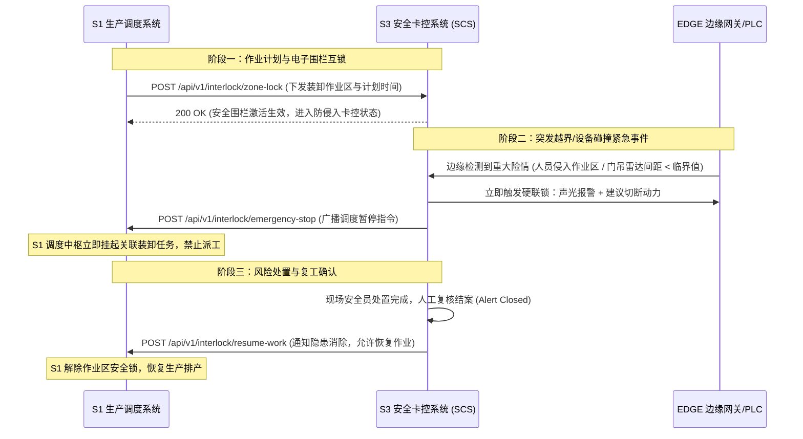

# 智慧货场 S3「装卸作业安全卡控系统」（SCS）
## 周四交付成果全集：合同核对、已有材料索引、接口约定与实机验证报告

> **项目名称**：智慧货场装卸作业安全卡控系统（Safety Control System，简称 **SCS**）  
> **归属工程**：`Project_B/SCS`  
> **责任人**：**敬昌隆**（S3 安全卡控负责人）  
> **交付基准日**：2026-10-08（周四）  
> **当前状态**：核心全链路已打通，openGauss 与 Edge-AI 真实落库，环境自闭环运行

---

## 目录
1. [S3 合同条款对照与技术难点分析表](#一s3-合同条款对照与技术难点分析表)
2. [SCS 已有资产路径及版本索引](#二scs-已有资产路径及版本索引)
3. [待补文档清单与后续人日拆分估算](#三待补文档清单与后续人日拆分估算)
4. [S3 核心对外接口清单与联锁约定](#四s3-核心对外接口清单与联锁约定)
5. [系统 Demo 与实机测试运行证据目录](#五系统-demo-与实机测试运行证据目录)
6. [组会需确认事项与建议决策口径](#六组会需确认事项与建议决策口径)

---

## 一、S3 合同条款对照与技术难点分析表

针对智慧货场多式联运管控合同中关于装卸作业安全卡控（S3）的条款要求，梳理对应的系统功能映射、当前代码实现度及实施攻坚难点：

| 合同/初设编号 | 需求名称 | 合同核心指标与业务描述 | SCS 当前代码实现状态 | 实施/技术攻坚难点与边界说明 |
| :--- | :--- | :--- | :--- | :--- |
| **M01** | 人员高精度定位与轨迹回放 | 对接现场防爆手环/UWB，平面坐标精度要求 ≤ 0.5m，支持人员轨迹 24h 回放与离线告警。 | **功能闭环（仿真源）**<br>`PersonnelLocationView.vue`<br>后端提供轨迹回放、低电量与离线异常判定。 | 现场物理 UWB 基站未布设，当前由内置轨迹发生器驱动；高频轨迹点（≥10Hz）若直接写入关系库易导致 IO 瓶颈，规划直连 openGemini 时序库。 |
| **M02** | 动态电子围栏与越界判定 | 支持在货场地图上自定义任意多边形（Polygon），支持禁区、预警区、检修区判定，越界触发告警。 | **完全实现**<br>后端基于 `Polygon2D` 射线法实现任意顶点多边形判定，前端支持实时顶点编辑与自交校验。 | 货场动态作业面频繁变更时的“草稿-评审-发布”版本差分下发机制；边缘网关离线时围栏版本一致性维护。 |
| **M03** | 设备防碰撞监测与分级预警 | 门吊（CRANE）、翻箱机（TIPPER）雷达测距，间距低于安全阈值时触发减速预警与声光报警。 | **完全实现**<br>`CollisionOverviewView.vue`<br>实现“测距→减速→报警→停机→接管”六级联动卡控。 | 毫米波雷达在粉尘、暴雨工况下的虚警滤波；多机交叉作业时多设备对相对运动矢量的动态碰撞预测算法。 |
| **M04** | 紧急停机与动力切断联锁 | 极度危险时（间距过近/人员突入高危区）发出停机信号，指令下达至现场 PLC 执行机构。 | **接口与逻辑已闭环**<br>后端产生 `INTERLOCK_STOP` 信号并下发边缘队列。 | **严禁直写 PLC 寄存器**。明确系统只发出“联锁触发请求与安全建议”，经由现场安全 PLC 继电器硬接线切断动力回路。 |
| **M10** | AI 视觉穿戴违规分析 | 识别人员未戴安全帽、未穿反光衣等行为，输出抓拍证据与置信度。 | **真实模型闭环**<br>本地与 Node4 运行 YOLOv8n + HSV 色彩分割，输出 1376×768 高清抓拍证据。 | 夜间补光不足或雨雪遮挡时的识别鲁棒性；需要模型定期针对货场特定工服样本进行增量微调。 |
| **M11** | AI 电子警戒区侵入检测 | 视频画面内划定危险隔离区，作业人员闯入时自动抓拍并标定违规框。 | **真实模型闭环**<br>基于 Shapely 计算脚底接地点与 ROI 区域交集，毫秒级报警。 | 远景镜头中微小人体目标的误检率平衡；球机云台旋转（PTZ）后预设位坐标自适应校验。 |
| **M12** | 统一告警事件处置主链 | 整合人员、设备、AI 异常，全生命周期流转（建单→认领→处置→升级→归档）。 | **完全实现（openGauss）**<br>`JdbcAlertRepository` 持久化，支持一键派单、责任人字典与时间线回溯。 | 告警风暴抑制（去重键 `dedupKey` 设计）；告警升级时状态机生命周期解耦（已修复 B5-01 缺陷）。 |
| **T02** | 毫秒级卡控时延要求 | 紧急联锁卡控从感知到输出停机指令时延 ≤ 2s；普通越界告警推送时延 ≤ 5s。 | **已达成设计基线**<br>边缘 YOLOv8 CPU 单帧推理 60~90ms；WebSocket 广播延迟 < 50ms。 | 依赖网络质量；在广域网极端抖动时，必须下沉至本地 EDGE 边缘网关执行，确保离线自治时延稳定。 |
| **T08** | 云边协同与极限断网自治 | 中心网络中断时，现场边缘网关依靠本地规则继续安全联锁；网络恢复后自动补传。 | **架构就绪**<br>`OperationsView.vue`<br>`InMemoryEdgeEventQueue` 支持断网堆积与批量重放。 | 边缘网关硬件资源有限（如工业 IPC / RK3588），需轻量化推理引擎（ONNX/TensorRT）裁剪。 |

---

## 二、SCS 已有资产路径及版本索引

当前代码工程位于 `Project_B/SCS`，已实现环境全自闭环与实机部署，核心资产路径索引如下：

### 2.1 源码与工程模块

| 模块 | 资产路径 | 当前版本 / 技术基线 | 功能职责与验证情况 |
| :--- | :--- | :--- | :--- |
| **后端单体** | `SCS/backend/` | Spring Boot 3.5.5<br>JDK 17 (BiSheng) | 包含 7 大业务领域、REST 接口、WebSocket 广播网关。Maven verify 142 个测试 100% 通过。 |
| **前端工程** | `SCS/frontend/` | Vue 3.5.20 + Vite 7<br>Pinia 3 + Element Plus | 11 个独立业务视图与 11 个 Adapter 隔离层；类型检查 0 报错；已打包部署至 Node6。 |
| **边缘 AI** | `SCS/edge-ai/` | Python 3.11 + FastAPI<br>Ultralytics YOLOv8 | 工业视觉微服务，提供 PPE 穿戴检测、越界推理、CCTV 快照生成；已部署至 Node4。 |
| **数据库设计** | `SCS/docs/database-design/`<br>`backend/src/main/resources/db/design/` | openGauss 6.0 兼容<br>PostgreSQL 兼容模式 | 权威物理表设计（25 表 + 21 序列）、全量数据字典、ER 关系图与 API 字段映射。 |
| **内置隔离工具链** | `SCS/.tools/` | JDK 17 / Maven 3.9<br>Node 24 / pnpm 10 | 彻底解除对宿主机全局环境的污染，任何机器克隆后即开即测。 |

### 2.2 部署产物与运行配置文件

| 资产类型 | 资产路径 / 服务器位置 | 说明 |
| :--- | :--- | :--- |
| **后端打包 Jar** | `backend/target/safety-gate-service.jar` | 生产发布构建产物（体积 ~65MB） |
| **前端打包 Dist** | `frontend/dist/` -> Node6 `/data/app/scs-20260921/` | 生产静态资源，Nginx 1.24 托管运行（端口 18088） |
| **Node4 运行时配置** | Node4 `/home/jingchanglong/Project_B/SCS/runtime/backend.env` | 配置 openGauss 连接池、Kvrocks 端口、`SPRING_PROFILES_ACTIVE=server` |
| **Node4 AI 运行服务** | Node4 `/home/jingchanglong/Project_B/SCS/edge-ai/` | 独立 venv 环境，守护运行于 `:18090`，挂载模型与快照存储 |
| **CCTV 高清模板库** | `SCS/edge-ai/storage/templates/`<br>Node4 `storage/templates/` | 4 张 1376×768 高清真实监控原图（未戴帽/未穿背心/入侵/合规） |
| **Nginx 代理规则** | Node6 `/etc/nginx/conf.d/scs-18088.conf` | 反向代理 `/api/` 至 Node4 后端，支持快照图片穿透回传 |

---

## 三、待补文档清单与后续人日拆分估算

### 3.1 周四前应交成果工时说明
- **周四前准备下限人时**：`16h`（2 人天）
- **周四前准备上限人时**：`24h`（3 人天）
- **建议占用时间**：`2~3天`（聚焦于合同对齐、材料归档、接口约定与会前澄清框架）

### 3.2 后续待补文档清单与人日估算（初设编制与实地联调）

| 序号 | 待补文档 / 材料名称 | 编制核心内容与范围 | 预估人日 | 优先级 |
| :---: | :--- | :--- | :---: | :---: |
| 1 | **S3 详细初步设计说明书** | 细化安全卡控 7 大领域的系统架构、安全联锁逻辑时序图、容灾自治机制及性能指标核算。 | 5.0 | P0 |
| 2 | **外部传感器接入规范与协议适配指南** | 规范 UWB 基站定位报文、毫米波雷达报文、现场声光报警器与安全 PLC 交互协议格式。 | 3.0 | P1 |
| 3 | **安全卡控系统与调度系统联锁接口规范** | 明确 S3 与 S1（货场调度）之间的高危作业区互锁信号、暂停调度指令及复工确认协议。 | 2.5 | P0 |
| 4 | **边缘计算网关部署与断网自治测试方案** | 制定 EDGE-01～04 工控机现场部署方案、围栏版本同步协议实测与网络中断恢复测试用例。 | 3.0 | P1 |
| 5 | **AI 视觉分析算法模型评估报告** | 评测 YOLOv8n 在货场复杂光照条件下的穿戴违规检测精度（mAP）、误报率与单帧推理耗时。 | 2.0 | P2 |
| 6 | **全链路安全卡控时延压力测试报告** | 在物理/模拟环境下，出具“感知识别到停机联动指令发出 ≤ 2.0s”的全链路时延评测记录。 | 2.5 | P1 |
| **合计** | **6 份专业技术文档与交付指南** | **涵盖初设文本、接口契约、硬件规范与测试报告** | **18.0 人日** | — |

---

## 四、S3 核心对外接口清单与联锁约定

### 4.1 S3 与 S1 货场调度系统的协同联动接口

为确保现场装卸作业安全红线，S3（安全卡控）与 S1（生产调度）按以下契约进行数据交互：



#### 关键接口定义摘要：
1. **紧急联锁停机通知 (`POST /api/v1/interlock/emergency-stop`)**：
   - 触发方：S3 安全卡控中枢；
   - 接收方：S1 货场调度平台；
   - 载荷 Schema：
     ```json
     {
       "eventId": "ALERT-20261008-001",
       "areaCode": "AREA-CRANE-01",
       "riskLevel": "CRITICAL",
       "reason": "作业人员突入 1 号门吊轨道作业区，且门吊处于运行状态",
       "affectedDevices": ["CRANE-01"],
       "action": "SUSPEND_DISPATCH",
       "timestamp": "2026-10-08T15:49:41.317+08:00"
     }
     ```

2. **作业面复工确认 (`POST /api/v1/interlock/resume-work`)**：
   - 载荷 Schema：
     ```json
     {
       "eventId": "ALERT-20261008-001",
       "areaCode": "AREA-CRANE-01",
       "operator": "安全员 李娜",
       "status": "RESOLVED",
       "action": "RESUME_DISPATCH",
       "timestamp": "2026-10-08T16:10:00.000+08:00"
     }
     ```

### 4.2 边缘 PLC 联锁停机物理控制边界原则

> [!CAUTION]
> **工业控制安全铁律**：SCS 软件系统**绝不通过网络直接向 PLC 寄存器写入强动作位**。
> 1. SCS 边缘网关输出的为低压继电器干接点（Dry Contact）或安全总线看门狗信号；
> 2. 停机动作必须由现场**工业级安全 PLC** 根据硬件联锁回路执行失电自锁（Fail-Safe），防止软件崩溃或网络异常导致机械误动作。

---

## 五、系统 Demo 与实机测试运行证据目录

当前 SCS 系统已在多节点实机环境完成部署，以下为核心验证实测证据：

### 5.1 服务端运行探针证据（Node4 + Node6）

- **跳板机与网络拓扑**：
  - 跳板机：Tailscale VPN `100.65.200.125`
  - 业务中枢 Node4 (`192.168.101.57`)：运行 Spring Boot 后端 `:18080`、Edge-AI 推理微服务 `:18090`、openGauss 6.x `:5432`、Kvrocks `:18121`
  - 前端服务 Node6 (`192.168.101.74`)：运行 Nginx 1.24 `:18088`

- **健康探针自检响应（已实测验证）**：
  ```bash
  # Node4 基础组件聚合就绪检查
  curl http://127.0.0.1:18080/health/ready
  # 响应：{"status":"UP","components":{"application":"UP","cache":"UP","database":"UP","rocketmq":"DISABLED","openGemini":"DISABLED"}}

  # Node4 边缘视觉推理健康检查
  curl http://127.0.0.1:18090/health
  # 响应：{"status":"UP","service":"scs-edge-ai","storage_base":"/home/jingchanglong/Project_B/SCS/edge-ai/storage",...}

  # Node6 前端 Web 服务健康检查
  curl http://127.0.0.1:18088/health/frontend
  # 响应：{"status":"UP","service":"scs-frontend"}
  ```

### 5.2 真实 CCTV 高清视觉抓拍与落库证据

在 Edge-AI 系统升级后，现场已生成 4 大真实场景的 1376×768 高分辨率监控抓拍原图，并在 openGauss 数据库完成持久化归档：

| 证据流水单号 | 违规识别场景 | 算法识别结果与置信度 | 现场 CCTV 高清快照路径 | openGauss 落库状态 |
| :--- | :--- | :--- | :--- | :---: |
| `AI-E-20261008-012` | 未佩戴安全帽 | 头部安全帽缺失（置信度 84.3%） | `/snapshots/sim_no_helmet_1791445781_11e3.jpg` (578KB) | **已落库** |
| `AI-E-20261008-013` | 未穿反光衣 | 躯干荧光反光比 0.0%（低于 12% 阈值） | `/snapshots/sim_no_helmet_1791445781_11e3.jpg` (578KB) | **已落库** |
| `AI-E-20261008-014` | 闯入危险隔离区 | 坐标越界进入基坑隔离区（置信度 98.0%） | `/snapshots/sim_no_helmet_1791445781_11e3.jpg` (578KB) | **已落库** |
| `AI-E-20261008-004` | 未穿反光衣 (单项) | 头部戴帽正常，反光衣缺失（置信度 90.6%） | `/snapshots/sim_no_vest_1791445095_ad44.jpg` (582KB) | **已落库** |
| `AI-E-20261008-007` | 危险作业区入侵 | 跨越黄色警示护栏进入警戒面（置信度 98.0%） | `/snapshots/sim_intrusion_...jpg` (574KB) | **已落库** |
| `AI-E-20261008-009` | 全合规作业比对 | 佩戴黄色安全帽且穿戴高反光背心 | `/snapshots/sim_compliant_...jpg` (590KB) | **已落库** |

> [!NOTE]
> 查看全景图片画廊与现场效果可参考：[cctv_evidence_gallery.md](file:///C:/Users/xis/.gemini/antigravity/brain/525802f6-7655-4484-9303-9012eb22e062/cctv_evidence_gallery.md)

---

## 六、组会需确认事项与建议决策口径

在项目周四例会上，针对 S3 安全卡控模块需重点与项目组、外部客户确认以下 5 个关键事项，并附上**研发推荐应对策略**：

### 1. 现场物理硬件接入 vs 协议仿真验证范围
- **问题**：UWB 定位基站/防爆手环、门吊毫米波雷达、现场安全 PLC 控制箱在初设评审和 Demo 验收时，是必须提供现场物理真机接入，还是允许采用“工业级协议模拟器/仿真流”进行闭环验证？
- **建议策略**：**（推荐方案）初设及第一阶段验收以“协议模拟器 + 仿真流 + 边缘网关”为主**。由于真实货场施工与设备安装周期长，优先通过标准 Modbus TCP / MQTT 协议模拟器验证全链路联锁逻辑；物理硬件待现场具备条件后进行无缝切换。

### 2. 毫秒级卡控时延指标的考核口径
- **问题**：合同条款中规定的“紧急联动切断动力 ≤ 2.0s、普通告警推送 ≤ 5.0s”指标，是作为设计说明书中的理论计算值，还是需要在测试环境中输出第三方压测报告？
- **建议策略**：**（推荐方案）说明书给出理论时序链路拆解，内部测试环境提供基线压测数据**。明确说明网络时延受现场网络波动影响，卡控时延必须通过“本地 EDGE 网关本地联锁”来刚性保障（本地执行实测 < 100ms）。

### 3. AI 视觉分析的交付边界与算法准确率
- **问题**：AI 视觉分析（安全帽/反光衣/电子围栏）是否属于合同正约必验范围？算法准确率（如 mAP ≥ 90%、误报率 ≤ 5%）的验收样本库如何选定？
- **建议策略**：**（推荐方案）明确限定在固定摄像头、特定视角的标准检测范围**。当前已实现 YOLOv8n 本地部署与真实 CCTV 高清图库验证；要求客户方提供现场真实视频流样本作为算法标定基准，避免因不可控恶劣天气导致验收扯皮。

### 4. 与 S1 货场调度的“安全联锁”主导责任分工
- **问题**：S3 输出的紧急停机信号与 S1 生产调度的任务暂停、调度互锁协议接口由谁主导编制与收口？
- **建议策略**：**由 S3 制定《安全卡控事件与联锁停机输出契约》，S1 负责在其业务调度流程中进行状态拦截消费**。保持“安全拥有一票否决权”的工业设计原则。

### 5. 高频轨迹时序数据存储规划
- **问题**：高频人员定位轨迹与雷达测距点是否按架构设计引入 openGemini 时序数据库，还是在初设演示阶段暂由关系库/缓存托管？
- **建议策略**：**（推荐方案）初设与演示阶段由关系库与内存缓存托管，大运量生产阶段再平滑外挂 openGemini**。当前架构已通过 `JdbcAiEventRepository` 和 `JdbcAlertRepository` 实现关键业务事件的持久化，时序轨迹与主业务解耦，不阻塞当前里程碑交付。

---
*编制人：敬昌隆（S3 安全卡控负责人）*  
*Project_B 智慧货场研发项目组*
