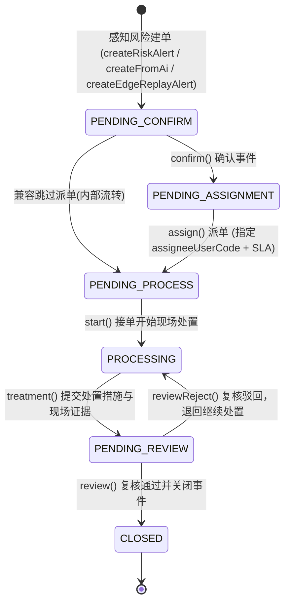

# 02 - 业务领域模型与 Alert 处置主链深度分析

> **核心结论**：通过对当前源码全部调用路径的实际追踪核验，**`AlertService` 确实是当前 SCS 系统中所有感知风险与安全事件的全局唯一闭环处置主链**。没有任何模块旁路自建第二套处置状态机。

---

## 1. 七大核心业务领域职责与模型概览

| 领域 | 核心职责 | Controller | Service | Repository | 关键领域模型 (Domain / Model) | 与 Alert 关系 |
|---|---|---|---|---|---|---|
| **Alert** (告警处置) | 全局安全事件唯一流转中枢：派单、认领、处置、升级、复核、结案、SLA 计算、时间线 | `AlertController` | `AlertService` | `AlertRepository` (`InMemoryAlertRepository`) | `DemoAlert`, `TimelineEvent`, `LinkageStep`, `TreatmentRecord`, `AlertEvidence` | **核心聚合根 / 处置主链** |
| **AI Event** (违规识别) | 摄像头 AI 视觉分析违规事件抓拍、人工复核确认、误报标记、转安全告警 | `AiEventController` | `AiEventService` | `AiEventRepository` (`InMemoryAiEventRepository`) | `DemoAiEvent`, `AiBox`, `AiTimelineNode`, `CameraInfo` | 复核违规后调用 `AlertService` 创建告警 |
| **Collision** (设备防碰撞) | 门吊/翻箱机空间相对距离监测、超限判定、六级联动停机控制、雷达故障模拟 | `CollisionController` | `CollisionService` | `CollisionRepository` (`InMemoryCollisionRepository`) | `DemoCollisionDevice`, `PairState` (运行态), `DistancePoint`, `CollisionStep` | 距离超标调用 `AlertService` 建单或就地升级 |
| **Personnel** (人员定位) | 作业人员实时坐标映射、手环电量/在线监测、越界检测 (Point-In-Polygon)、轨迹回放 | `PersonnelController` | `PersonnelService` | `PersonnelRepository` (`InMemoryPersonnelRepository`) | `DemoPersonnel`, `TrackPoint` (即时生成), `BraceletStatuses` | 越界命中危险围栏后调用 `AlertService` 建单 |
| **Fence** (电子围栏) | 任意多边形 (Polygon) 围栏绘制、自交校验、草稿/评审/发布/生效/停用全流程、边缘节点下发 | `FenceController` | `FenceService` | `FenceRepository` (`InMemoryFenceRepository`) | `DemoFence`, `FencePoint`, `FenceStatuses`, `fence.model.EdgeNode` | 为人员越界提供空间判定边界与风险等级 |
| **Rule** (规则配置) | 卡控规则阈值配置、生效中规则派生次版本草稿、版本热发布、下发边缘网关 | `RuleController` | `RuleService` | `RuleRepository` (`InMemoryRuleRepository`) | `DemoRule`, `RuleVersion`, `RuleParam`, `RuleQuery` | 为告警生成提供判定依据与 Provenance 溯源信息 |
| **Operations** (边缘与自治) | 边缘节点 (EDGE-01~04) 健康度监控、网络断网模拟、离线事件本地联锁、恢复后幂等补传重放 | `OperationsController`, `EdgeAutonomyController` | `EdgeOpsService`, `EdgeReplayService` | `EdgeNodeRepository`, `EdgeEventQueueRepository`, `OpsEventLogRepository` | `DemoEdgeNode`, `EdgePendingEvent`, `OpsEventLog`, `EdgeLocalLinkage` | 断网补传事件经 `EdgeReplayService` 汇入 Alert 主链 |

---

## 2. 感知风险汇聚至 Alert 主链的真实代码调用链

通过对真实源码的方法级追踪，各感知域到 Alert 主链的调用链如下：

### 2.1 AI Event → Alert 调用链路
```text
[HTTP POST /api/v1/ai-events/{id}/review/confirm]
  └── AiEventController#confirm(id, body, idemKey)
      └── AiEventService#confirm(id, body, idemKey)
          ├── 校验状态为 PENDING / UNCERTAIN，更新 statusCode = CONFIRMED
          ├── 若 event.linkedAlertId == null:
          │   └── AlertService#createFromAi(NewAlertFromAi draft)
          │       └── AlertService#createRiskAlert(NewRiskAlert draft)
          │           ├── AlertRepository#save(DemoAlert a)
          │           └── AlertChangeNotifier#changed("new", a) -> LiveEventGate
          ├── 回写 event.linkedAlertId = alert.id
          ├── AiEventRepository#save(event)
          └── LiveEventGate#flush() (广播 ai.reviewed + alert.new)
```
*注：`AiEventService#assign` 同样会检查 `event.linkedAlertId`，若为空先创建 Alert，然后自动串联 `AlertService#confirm` 与 `AlertService#assign`，绝不实现第二套派单。*

### 2.2 Collision → Alert 调用链路
```text
[HTTP POST /api/v1/collision/simulate/approach]
  └── CollisionController#simulateApproach(body)
      └── CollisionService#simulateApproach(body)
          ├── 判定相对距离 value <= 5.4m:
          │   └── CollisionService#ensureCollisionAlert(PairState pair, SEVERE)
          │       ├── AlertService#findOpenByDedupKey("COLLISION:" + pair.currentId + ":" + pair.relatedId)
          │       ├── 若存在未关闭告警: 复用 open.id，置 pair.activeAlertId = open.id
          │       └── 若不存在:
          │           ├── AlertService#createRiskAlert(NewRiskAlert)
          │           │   └── AlertRepository#save(DemoAlert)
          │           ├── 更新 pair.activeAlertId = alert.id
          │           └── 更新 cur.latestAlertId = alert.id 并 CollisionRepository#save(cur)
          └── 判定相对距离 value < 3.0m (紧急阈值):
              └── AlertService#upgradeRisk(pair.activeAlertId, RiskLevels.URGENT, "相对距离降至 ...")
                  ├── 更新 alert.upgradedFromCode 与 alert.riskCode = URGENT (保持 statusCode 不变)
                  ├── AlertRepository#save(alert)
                  └── Notifier 广播 alert.escalated
```

### 2.3 Personnel / Fence 越界 → Alert 调用链路
```text
[HTTP POST /api/v1/personnel/{id}/simulate]
  └── PersonnelController#simulate(id, body)
      └── PersonnelService#simulate(id, action, idemKey)
          └── PersonnelService#intrude(DemoPersonnel p)
              ├── FenceRepository 查询已生效的危险围栏 (FenceStatuses.EFFECTIVE)
              ├── 计算围栏内部点，将人员位置突变为围栏内坐标 (Point-In-Polygon)
              ├── 构造去重键 dedupKey = "PERSON_INTRUSION:" + p.id + ":" + fence.id
              ├── AlertService#createRiskAlert(NewRiskAlert)
              │   ├── 检查未关闭去重键 -> 若无则创建 ALM-yyyyMMdd-NNN
              │   └── AlertRepository#save(DemoAlert)
              └── 更新 p.activeAlertIds = List.of(alert.id)
```

### 2.4 EDGE 离线事件补传 → Alert 调用链路
```text
[HTTP POST /api/v1/ops/edge/autonomy/{nodeId}/replay]
  └── EdgeAutonomyController#replay(nodeId)
      └── EdgeOpsService#replay(nodeId)
          └── EdgeReplayService#replayPending(DemoEdgeNode node)
              └── EdgeReplayService#replayOne(EdgePendingEvent incoming, node)
                  ├── EdgeEventQueueRepository 幂等判重 (已 SYNCED 或同 idempotencyKey 已消费则标 DUPLICATE)
                  └── 正常补传:
                      ├── 标记 event.status = SYNCING 并 queueRepository.save(event)
                      ├── AlertService#createEdgeReplayAlert(EdgeReplayDraft draft)
                      │   ├── 记录 occurredAt 为边缘发生时刻，syncedAt 为当前平台时刻，计算 syncDelaySec
                      │   ├── 构造 dedupKey = "EDGE-REPLAY:" + draft.edgeNodeId() + ":" + draft.offlineEventId()
                      │   ├── 组装边缘本地离线处置时间线 (EDGE_REPLAY 节点)
                      │   └── AlertRepository#save(DemoAlert)
                      ├── 回写 event.status = SYNCED, event.linkedAlertId = alert.id 并 queueRepository.save(event)
                      └── 记录 OpsEventLogRepository#append(...)
```

---

## 3. Alert 生命周期与状态机模型

### 3.1 状态机与业务流转（严格代码实现）

Alert 的业务处置主链包含 7 个标准状态（`com.bproject.safety.module.alert.model.AlertStatuses`）：



### 3.2 移动端巡检阶段（`mobileStage`）
在主状态处于 `PENDING_PROCESS`（待处理）期间，现场安全员移动端具备子阶段流转：
- `PENDING`（待响应） → `mobileAccept()` → `ACCEPTED`（已接单，赶往现场） → `mobileArrive()` → `ARRIVED`（已到场） → `start()` 进入 `PROCESSING`。

---

## 4. 关键架构核查与 Finding 落地核实

### 4.1 业务状态（Status）与风险等级（Risk Level）是否已彻底解耦？
- **源码事实**：**完全解耦**。
  - 业务状态字段为 `alert.statusCode`（取值见 `AlertStatuses`：`PENDING_CONFIRM`, `PENDING_ASSIGNMENT`, `PENDING_PROCESS`, `PROCESSING`, `PENDING_REVIEW`, `CLOSED`）。
  - 风险等级字段为 `alert.riskCode`（取值见 `RiskLevels`：`NORMAL`, `WARNING`, `SEVERE`, `URGENT`）。
  - **历史遗留的 `AlertStatuses.ESCALATED` 已被废弃**。在 `AlertService#escalate` 中，升级仅提升 `alert.riskCode = target`，并记录原等级 `alert.previousRiskLevelCode = oldCode`；主状态 `statusCode` 保持原值不变（若历史为 ESCALATED 则回正为 PROCESSING）。

### 4.2 去重键（dedupKey）与幽灵告警清除
- **去重机制**：
  - `AlertRepository#findOpenByDedupKey(dedupKey)` 查询是否存在非 `CLOSED` 的同去重键告警；
  - 碰撞去重键格式：`COLLISION:{currentId}:{relatedId}`；
  - 人员越界去重键格式：`PERSON_INTRUSION:{personnelId}:{fenceId}`；
  - 边缘补传去重键格式：`EDGE-REPLAY:{edgeNodeId}:{offlineEventId}`。
- **碰撞幽灵告警消除（B5-02 闭环事实）**：
  - 在 `CollisionService#ensureCollisionAlert` 中，首先执行 `alertService.findOpenByDedupKey(dedupKey(pair))`；
  - 如果告警中心该告警已被安全员关闭（返回 `null`），代码显式执行：
    ```java
    if (pair.activeAlertId != null) {
        pair.activeAlertId = null; // 彻底清除旧缓存，强制重开全新告警
    }
    ```
  - 在 `CollisionService#resetPair` 中，显式设置 `pair.activeAlertId = null;`。设备实体表 `collision_device` 彻底移除了 `active_alert_id` 强关联列，杜绝数据库与内存状态打架。

### 4.3 证据链多态模型（AlertEvidence）
告警证据使用 Java 17 `sealed interface AlertEvidence`，严格区分 5 类业务证据结构：
1. `AiEvidence`：抓拍图 URL、置信度、Bounding Box 检测框、摄像头编号；
2. `CollisionEvidence`：当前测距、相对速度、近 10 秒测距走势数组、雷达健康态、预测制动距离；
3. `PersonnelEvidence`：人员平面坐标、所在区域、所属围栏、手环在线/震动状态；
4. `EdgeReplayEvidence`：离线事件 ID、发生时刻、补传时延、边缘本地判定与联动回执；
5. `GenericEvidence`：通用文本与附加信息。
未来在 openGauss 中通过 `safety.safety_alert_evidence` 表以 `evidence_type` + `JSONB` 结构高保真落库。
