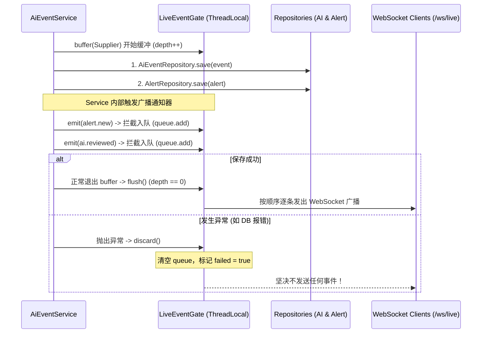

# 05 - 事务边界分析与实时事件机制（LiveEventGate）

> **核心现状**：当前 SCS 后端工程中，**`@Transactional` 注解的使用数量为 0，`TransactionTemplate` 使用数量为 0**。当前跨聚合写操作与并发控制完全依赖单 JVM 内存的 `synchronized` 方法锁。

---

## 1. 事务现状与跨聚合写操作风险审计

在将数据持久化迁移至 openGauss 之后，传统的单机 JVM 内存锁无法跨进程、跨事务生效。以下是必须实施数据库声明式事务控制（`@Transactional`）的核心业务场景：

| 业务工作流 (Use Case) | 顶层入库方法 (Workflow Entry) | 涉及聚合与操作内容 | 当前内存控制 | 落库后事务要求 (`@Transactional`) | 未加事务的核心故障风险 |
|---|---|---|---|---|---|
| **AI 复核确认建单** | `AiEventService#confirm` | 1. 校验并更新 `AiEvent` (已确认)<br>2. 调用 `AlertService` 创建告警<br>3. 回写 `linkedAlertId` 到 AI 聚合<br>4. 写入双侧时间线 | `synchronized` | **强事务 (REQUIRED)** | 告警已插入成功，但回写 AI 事件或数据库连接超时，导致“孤儿告警”且 AI 事件未关联。 |
| **AI 复核直接派单** | `AiEventService#assign` | 1. 创建或获取对应 Alert<br>2. 推进 Alert 待确认 → 待派单 → 待处理<br>3. 同步 AI 事件责任人与派单状态 | `synchronized` | **强事务 (REQUIRED)** | 告警流转已推进到待处理，但 AI 事件由于校验失败未更新，前后端状态永久分裂。 |
| **防碰撞风险判定建单** | `CollisionService#ensureCollisionAlert` | 1. 告警中心去重判定<br>2. 创建碰撞告警<br>3. 关联更新设备台账 `latestAlertId` | `synchronized` | **强事务 (REQUIRED)** | 告警插入成功，但设备台账更新失败，设备列表无法高亮显示未处理碰撞。 |
| **人员越界判定建单** | `PersonnelService#intrude` | 1. 围栏空间判定<br>2. 创建越界告警<br>3. 关联更新人员 `activeAlertIds` | 无 (单一线程模拟) | **强事务 (REQUIRED)** | 告警表插入成功，但人员状态未变更。 |
| **边缘离线补传重放** | `EdgeReplayService#replayOne` | 1. 标记离线事件为 `SYNCING`<br>2. 调用 AlertService 建单<br>3. 回写状态为 `SYNCED`<br>4. 插入 `OpsEventLog` 运维审计日志 | `synchronized` | **强事务 (REQUIRED)** | 离线事件补传建单成功，但状态未回写为 SYNCED，重启后发生重复建单灾难。 |
| **安全规则版本发布** | `RuleService#publish` | 1. 提升主版本号<br>2. 插入 `safety_rule_version` 快照<br>3. 插入/更新 4 个边缘节点同步表 | `synchronized` | **强事务 (REQUIRED)** | 主版本已变更，但边缘同步子表插入失败，导致规则版本处于不一致孤儿态。 |
| **电子围栏多边形发布** | `FenceService#publish` | 1. 状态变更为 EFFECTIVE<br>2. 插入 `safety_fence_version` 快照<br>3. 插入/更新 4 个边缘节点同步表 | `synchronized` | **强事务 (REQUIRED)** | 围栏状态已变更为已生效，但多边形版本快照缺失。 |

---

## 2. 实时事件门控（LiveEventGate）深度剖析

`com.bproject.safety.common.realtime.LiveEventGate` 是 Phase B 引入的关键组件，用于解决**“多步保存过程中半途广播 WebSocket 事件”**的脏数据问题：



### 2.1 源码工作原理核查
1. **ThreadLocal 上下文**：
   内部维护 `ThreadLocal<Context>`，`Context` 包含 `depth` 计数器、`failed` 标记及 `List<Runnable> queue`。
2. **支持多层嵌套调用（Reentrancy）**：
   - 每次调用 `begin()` 使 `depth++`；
   - 每次调用 `flush()` 使 `depth--`，**只有当 `depth == 0`（最外层业务退出）时，才真正遍历执行 `queue` 中的广播动作**；
   - 经 `LiveEventGateReentrancyTest`（6 个测试）验证，能够完美应对 A-Service 调用 B-Service 的深度嵌套。
3. **异常隔离与丢弃**：
   - 当任何内层操作抛出异常时，触发 `discard()`，设置 `failed = true` 并清空队列，最外层退出时坚决不执行任何广播，避免脏事件泄露。

### 2.2 openGauss 落库后的“致命短板”与演进路径
> ⚠️ **关键风险预警**：  
> 当前的 `LiveEventGate` **仅仅是 Java 进程内的逻辑事务感知，并没有与 Spring 数据库事务管理器（PlatformTransactionManager）进行物理绑定**！

如果在未来引入真实 openGauss 数据库后：
1. `LiveEventGate.buffer()` 正常执行完毕，准备 `flush()` 发出 WebSocket 广播；
2. 此时 Spring 的 `@Transactional` 拦截器才开始执行底层数据库连接的 `connection.commit()`；
3. **如果数据库在此刻发生网络中断、唯一索引冲突或提交失败，数据库会发生回滚（Rollback），然而前端通过 WebSocket 已经收到了 `alert.new`！** 导致客户端大屏显示新告警，但数据库里根本查不到该记录（幽灵事件）。

### 2.3 下一阶段解决方案（Phase 1 必须落地）
- **短期方案（Phase 1 必做）**：
  将 `LiveEventGate.flush()` 改造为注册 Spring 事务同步器：
  ```java
  TransactionSynchronizationManager.registerSynchronization(new TransactionSynchronization() {
      @Override
      public void afterCommit() {
          // 仅在 openGauss 事务真正物理 COMMIT 成功后才推送 WebSocket
          doActualBroadcast(queue);
      }
  });
  ```
- **长期方案（Phase 2 生产级）**：
  引入 **Transactional Outbox 模式**：
  在业务事务内向 `safety.outbox_event` 表插入一条待发事件；由后台调度或 CDC（Debezium）可靠抓取并投递至 Apache RocketMQ，再由消费者广播 WebSocket，实现端到端的最终一致性。
