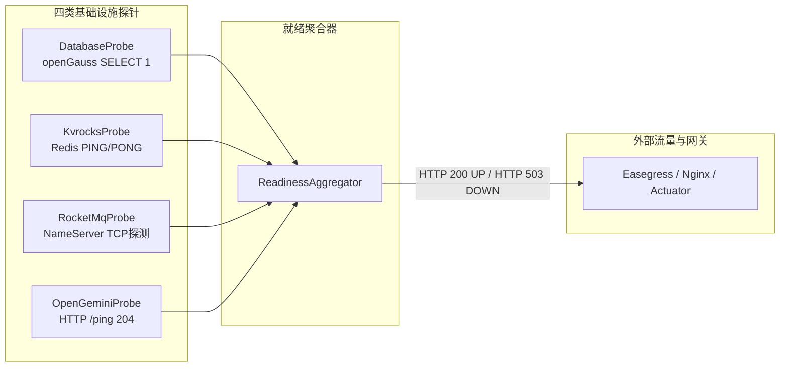

# 06 - 基础设施就绪探针、Profile 配置与运行边界

> **核心定位**：SCS 后端已建立了一套**云原生生产级探针与多 Profile 隔离体系**。即使当前 Repository 仍为 InMemory，系统已经具备检测真实 openGauss、Kvrocks、RocketMQ、openGemini 连通性的完整探针基础设施。

---

## 1. 基础设施探针体系（Readiness Probes）

后端在 `com.bproject.safety.infrastructure` 包下实现了标准的微服务健康检查契约，并通过 `ReadinessAggregator` 统一输出为 `/health/ready` 端点，直接供 Kubernetes / systemd / Easegress 2.11 负载均衡网关调用。

### 探针代码实现清单：
1. **`DatabaseProbe`**：
   - 注入 Spring `JdbcTemplate`；
   - 执行轻量心跳 SQL：`SELECT 1`；
   - 验证 openGauss 数据库实例、线协议与 HikariCP 连接池是否处于可用借出状态。
2. **`KvrocksProbe`**：
   - 注入 Spring Data Redis `RedisConnectionFactory`；
   - 执行底层 Redis 协议 `PING`，校验回执是否为 `PONG`。
3. **`RocketMqProbe`**：
   - 当 `app.rocketmq.enabled=true` 时，连接配置的 NameServer 地址测试网络连通性。
4. **`OpenGeminiProbe`**：
   - 当 `app.opengemini.enabled=true` 时，向时序库发出 HTTP `GET /ping`，期望返回 HTTP 204 No Content。
5. **`ReadinessAggregator`**：
   - 聚合上述探针；在 `server` profile 下，若 openGauss 或 Kvrocks 探针报 DOWN，端点立即返回 **HTTP 503 Service Unavailable**，防止流量打入未就绪的节点。

---

## 2. Spring Boot Profiles 矩阵与配置行为对照

工程内置 3 个核心 Profile，严格区分了开发、测试与生产服务器的运行行为：

| 配置维度 | `dev` (默认本地开发) | `server` (生产/测试服务器) | `test` (单元/集成测试) |
|---|---|---|---|
| **生效方式** | 默认激活 (`SPRING_PROFILES_ACTIVE=dev`) | 命令行 `--spring.profiles.active=server` | 测试类 `@ActiveProfiles("test")` |
| **openGauss 启动超时** | `initialization-fail-timeout: -1` （无数据库时平滑降级启动） | `initialization-fail-timeout: 5000` （**5秒内建连失败即抛异常退出**） | `initialization-fail-timeout: -1` |
| **Hikari 最大连接数** | 10 | `${OPENGAUSS_POOL_MAX:10}` | 默认 |
| **Demo 种子数据 (`seed-enabled`)** | **`true`** (启动自动注入基础台账) | **`false`** (安全默认，绝不污染生产库) | `true` |
| **模拟端点 (`simulator-enabled`)** | **`true`** (允许执行 simulate 等测试接口) | **`false`** (访问所有 simulate 端点返回 403) | `true` |
| **RocketMQ 启用** | `false` | `${ROCKETMQ_ENABLED:true}` | `false` |
| **openGemini 启用** | `false` | `${OPENGEMINI_ENABLED:true}` | `false` |
| **日志输出级别** | `com.bproject.safety: DEBUG` | `com.bproject.safety: INFO` | 过滤降噪 |

---

## 3. 环境变量清单（生产注入规范）

在 `deploy/backend/backend.env.example` 中已明确了服务器部署所需注入的环境变量，**代码中绝无硬编码账号密码**：

| 环境变量名 | 作用与配置说明 | 生产默认/推荐值示例 |
|---|---|---|
| `SPRING_PROFILES_ACTIVE` | 激活 profile | `server` |
| `SERVER_ADDRESS` | 监听网卡 IP | `0.0.0.0` |
| `SERVER_PORT` | 后端服务监听端口 | `18080` (或 `8080`) |
| `CORS_ALLOWED_ORIGINS` | 允许的跨域来源 | 仅填写 node6 Nginx 域名/IP |
| `OPENGAUSS_HOST` | openGauss 数据库实例 IP | `127.0.0.1` (或集群 VIP) |
| `OPENGAUSS_PORT` | openGauss 端口 | `5432` |
| `OPENGAUSS_DATABASE` | 业务数据库名 | `b_project` |
| `OPENGAUSS_USERNAME` | 数据库登录用户 | `safety_admin` |
| `OPENGAUSS_PASSWORD` | 数据库密码 | *(受保护凭据)* |
| `OPENGAUSS_POOL_MAX` | HikariCP 连接池上限 | `10` ~ `20` |
| `KVROCKS_HOST` / `PORT` | 分布式缓存/幂等服务 IP与端口 | `127.0.0.1:6666` |
| `KVROCKS_PASSWORD` | 缓存访问密码 | *(受保护凭据)* |
| `ROCKETMQ_ENABLED` | 是否启用消息总线 | `false` (第一阶段) / `true` |
| `ROCKETMQ_NAMESRV_ADDR` | RocketMQ NameServer 地址 | `127.0.0.1:9876` |
| `OPENGEMINI_ENABLED` | 是否启用时序库 | `false` (第一阶段) / `true` |
| `OPENGEMINI_URL` | openGemini HTTP 地址 | `http://127.0.0.1:8086` |
| `APP_DEMO_SEED_ENABLED` | 服务器强制启用种子 (演示备用) | 生产务必为 `false` |
| `APP_DEMO_SIMULATOR_ENABLED` | 服务器强制启用模拟 (演示备用) | 生产务必为 `false` |

---

## 4. 演示种子与模拟端点安全防护（DemoFeatureGuard）

为彻底消除“服务器环境下意外触发演示数据或导致真实业务数据被覆盖”的重大隐患，系统落地了 `DemoFeatureGuard` 安全门控：

1. **种子启动隔离（`DemoSeedInitializer`）**：
   - 实现了 Spring `CommandLineRunner`，在容器启动完成时检测 `guard.isSeedEnabled()`；
   - 仅当为 `true` 时才调用 `resetDemoData()` 灌种；`server` profile 默认跳过。
2. **模拟端点 403 阻断**：
   - 所有 Controller 的 `simulate*` 方法（如 AI 模拟、碰撞模拟、越界模拟、断网模拟）入口，均强制执行 `demoGuard.requireSimulator();`；
   - 若检测到 `simulatorEnabled == false`，立即抛出 `ApiException.forbidden("DEMO_FEATURE_DISABLED", ...)`，HTTP 返回 **403 Forbidden**，直接拒绝执行业务代码。
