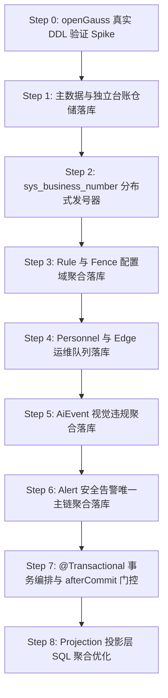

# 07 - Phase 1 openGauss 持久化实施路线图

> **目标**：以最小风险、分步可验证的方式，将 SCS 后端现存的 9 个 `InMemoryRepository` 全面平滑重构为基于 **openGauss 6.x** 的持久化实现，补齐事务边界与事件同步，达到生产级交付标准。

---

## 1. 迁移执行总体原则

1. **依赖拓扑决定顺序（由底向上，先叶子后聚合根）**：
   从无外键依赖的元数据/主数据开始，推进到规则与围栏，再接入高频实体，最后攻坚核心 `Alert` 聚合与跨聚合事务。
2. **接口稳定，零破坏性业务改动**：
   现有的 9 个 Repository 接口方法签名**保持 100% 不变**；新增 `Jdbc*Repository` 实现并使用 `@Primary` 或 Profile 条件注入替换内存实现；Controller 与 Service 业务代码无需改写接口依赖。
3. **主子表级联在 Repository 内部收口**：
   Service 只与聚合根交互；子表（如 `timeline`, `version`, `evidence`, `linkage`）的级联由对应的 `Jdbc*Repository` 在单一数据库事务中负责落库。
4. **单步可独立验证（Test-Driven Migration）**：
   每改造一个 Repository，立即运行对应的 ModuleIntegrationTest，断言测试 100% 转绿方可推进下一步。

---

## 2. 推荐八步实施详细方案



### Step 0：openGauss 实机 DDL 兼容性验证（Spike）
- **实施内容**：
  在目标 openGauss 6.0 测试环境建立 `safety` schema，完整执行 `openGauss-schema-final-draft.sql`。
- **校验重点**：
  - 21 个序列 `DEFAULT nextval('safety.seq_xxx')` 的绑定与驱动自增主键返回行为；
  - `JSONB` 字段类型兼容性（围栏多边形、规则参数、告警证据）；
  - `TIMESTAMPTZ` 时区转换行为；
  - 表/字段注释（`COMMENT ON`）语法兼容性。
- **验收出口**：25 张表全部创建成功，0 错误 0 告警，`DatabaseProbe` 返回 UP。

---

### Step 1：主数据与独立台账仓储落库
- **改动范围**：
  - 编写 `JdbcCollisionRepository` 替换 `InMemoryCollisionRepository`；
  - 编写 `JdbcEdgeNodeRepository` 替换 `InMemoryEdgeNodeRepository`；
  - 编写 `DemoMasterData` 的数据库预热/加载逻辑（`sys_team`, `safety_area`, `sys_user`, `device_camera`）。
- **对应数据表**：`collision_device`, `edge_node`, `sys_team`, `safety_area`, `sys_user`, `device_camera`。
- **Service 影响**：无。
- **事务要求**：只读/单表操作，默认单条自动提交。
- **测试要求**：`CollisionModuleIntegrationTest`、`MasterDataConsistencyTest` 全绿。

---

### Step 2：分布式发号器接管（消除单机内存扫描）
- **实施内容**：
  编写 `OpenGaussBusinessNumberGenerator`，实现 `AlertNumberGenerator`, `AiEventNumberGenerator`, `FenceNumberGenerator`, `RuleNumberGenerator` 四大接口。
- **对应数据表**：`safety.sys_business_number`。
- **实现算法**：
  利用 openGauss 行排他锁实现安全递增：
  ```sql
  SELECT last_seq FROM safety.sys_business_number 
  WHERE business_type = ? FOR UPDATE;
  
  UPDATE safety.sys_business_number 
  SET last_seq = last_seq + 1, updated_at = now() 
  WHERE business_type = ?;
  ```
- **测试要求**：多线程高并发测试，验证 0 重复号、0 间隙覆盖、格式完全兼容已有规范。

---

### Step 3：Rule 与 Fence 配置域聚合落库
- **改动范围**：
  - 编写 `JdbcFenceRepository` 替换 `InMemoryFenceRepository`；
  - 编写 `JdbcRuleRepository` 替换 `InMemoryRuleRepository`。
- **对应数据表**：
  - Fence: `safety_fence`, `safety_fence_version`, `safety_fence_edge_sync`；
  - Rule: `safety_rule`, `safety_rule_version`, `safety_rule_area`, `safety_rule_edge_sync`。
- **难点与重点**：
  - `FencePoint` 列表序列化为 JSONB 存入 `polygon_geojson` 列；
  - 生效规则（ACTIVE）编辑时，生成新版本草稿并安全写入 `safety_rule_version`。
- **测试要求**：`FenceModuleIntegrationTest`、`RuleModuleIntegrationTest`、`RuleActiveEditSemanticsTest` 全部通过。

---

### Step 4：Personnel 与 Edge 运维队列落库
- **改动范围**：
  - 编写 `JdbcPersonnelRepository` 替换 `InMemoryPersonnelRepository`；
  - 编写 `JdbcEdgeEventQueueRepository` 替换 `InMemoryEdgeEventQueueRepository`；
  - 编写 `JdbcOpsEventLogRepository` 替换 `InMemoryOpsEventLogRepository`。
- **对应数据表**：`safety_personnel`, `edge_pending_event`, `ops_event_log`。
- **重点**：
  - 保证 `EdgeEventQueueRepository#findPendingForReplay` 按照 `edge_occurred_at ASC, event_id ASC` 严格排序；
  - `OpsEventLogRepository#append` 映射为单条插入，查询映射为 `ORDER BY occurred_at DESC LIMIT ?`。
- **测试要求**：`PersonnelModuleIntegrationTest`、`OpsEdgeAutonomyIntegrationTest`、`EdgeReplayIdempotencyTest` 全部通过。

---

### Step 5：AI Event 视觉违规聚合落库
- **改动范围**：
  编写 `JdbcAiEventRepository` 替换 `InMemoryAiEventRepository`。
- **对应数据表**：`ai_event` (主表), `ai_event_timeline` (子表)。
- **重点**：主表保存 UUID 主键，时间线子表级联插入。
- **测试要求**：`AiModuleIntegrationTest` 全部通过。

---

### Step 6：Alert 安全告警唯一主链聚合落库（攻坚核心）
- **改动范围**：
  编写 `JdbcAlertRepository` 替换 `InMemoryAlertRepository`。
- **对应数据表**：
  - `safety_alert` (聚合根主表)
  - `safety_alert_timeline` (时间线，按 `sequence_no` 顺序存储与读取)
  - `safety_alert_evidence` (多态证据，以 JSONB 形式存储)
  - `safety_alert_treatment` (处置记录)
  - `safety_alert_linkage` 与 `safety_alert_linkage_step` (联动 7 步)
- **核心查询映射**：
  - `findOpenByDedupKey(dedupKey)` 映射为：
    `SELECT ... FROM safety.safety_alert WHERE dedup_key = ? AND status_code <> 'CLOSED' LIMIT 1`
  - `filter(AlertQuery)` / `page(AlertQuery)` 映射为带有动态条件的参数化 SQL。
- **测试要求**：`AlertModuleIntegrationTest`、`AlertEscalationWorkflowTest` 全部转绿。

---

### Step 7：声明式事务编排与 afterCommit 事件门控
- **改动范围**：
  - 在 `AiEventService#confirm`、`AiEventService#assign`、`CollisionService#ensureCollisionAlert`、`PersonnelService#intrude`、`EdgeReplayService#replayOne`、`AlertService` 等写操作方法上增加 `@Transactional(rollbackFor = Exception.class)`；
  - 改造 `LiveEventGate`：将广播发送动作挂载到 Spring 事务的 `TransactionSynchronization#afterCommit` 回调中。
- **验收标准**：
  编写异常回滚测试用例：当保存子表发生 SQLException 回滚时，断言没有任何 WebSocket 事件推送至客户端。

---

### Step 8：Projection 投影层 SQL 聚合优化
- **改动范围**：
  优化 `OverviewService`, `ScreenService`, `MobileService`, `AnalyticsService`。
- **实施内容**：
  消除原有的 `alertRepository.findAll().stream().filter(...)` 内存全量扫表逻辑，编写专用的只读聚合 SQL（如 `SELECT count(*), status_code, risk_level_code FROM safety.safety_alert GROUP BY status_code, risk_level_code`），极大降低内存与数据库 I/O 开销。

---

## 3. 完工定义（Definition of Done - DoD）

1. **零内存仓储运行**：在激活 `server` profile 启动时，9 个 Repository 100% 走真实 openGauss 数据表，无任何 `store.put()` 驻留；
2. **测试全绿**：全量 205 个后端测试用例（包括 SmokeTest, ModuleIntegrationTest, Phase B 架构硬化测试）在真实 openGauss 连接下全部通过；
3. **数据一致性验证**：重启后端 Spring Boot 进程后，页面刷新能够完整加载此前创建的告警、AI 复核与围栏数据；
4. **前端零感知**：所有前端 11 个业务页面的展示、操作、图表及 WebSocket 状态联动丝滑正常，无任何 400/500 报错。
