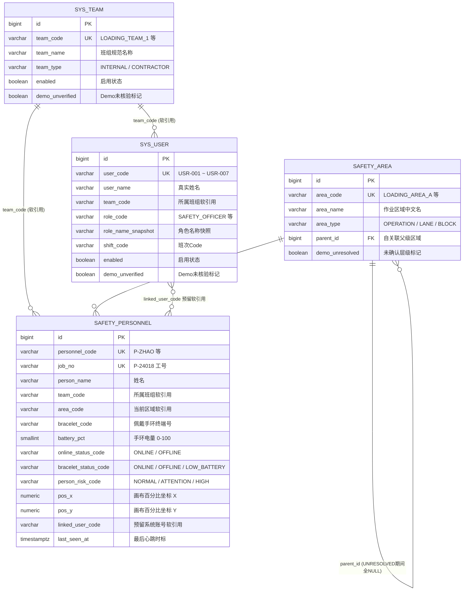
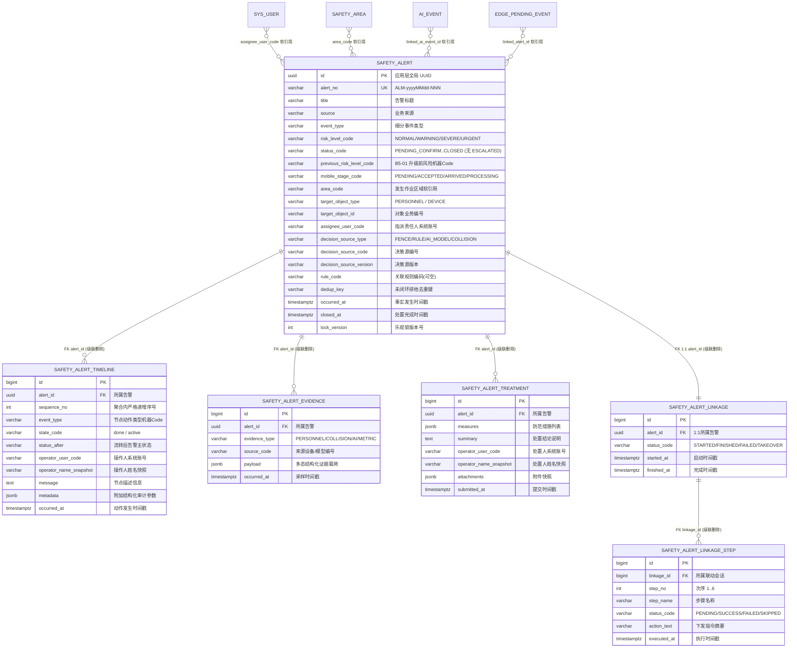
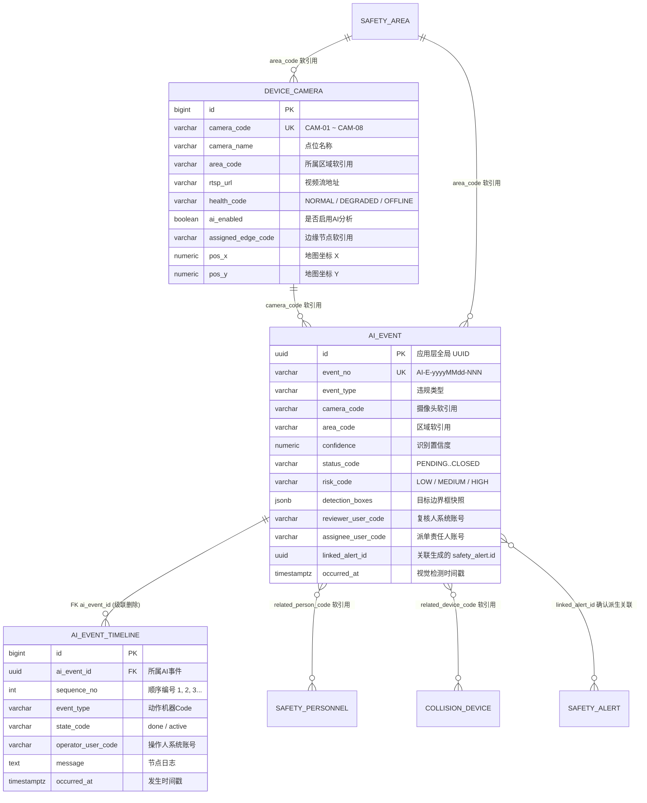
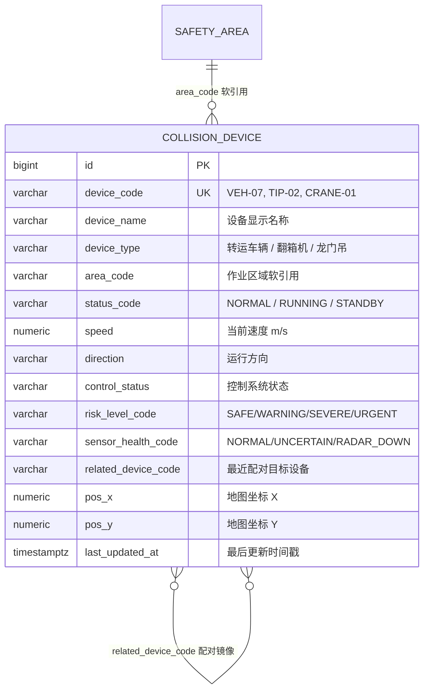
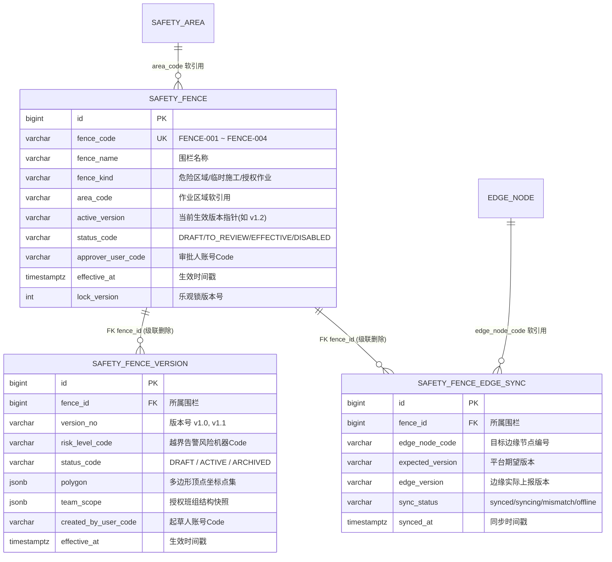
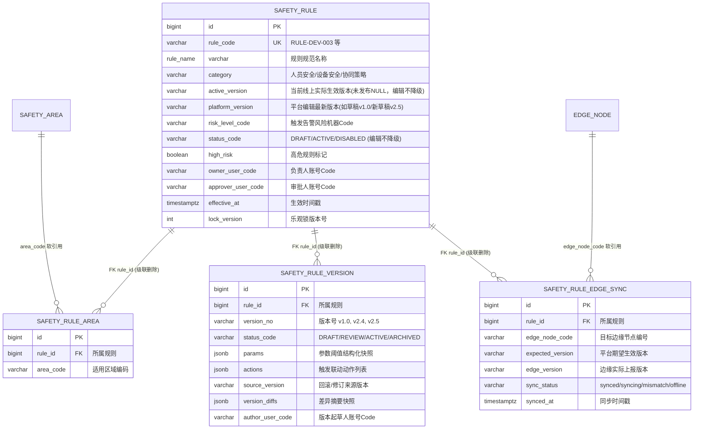
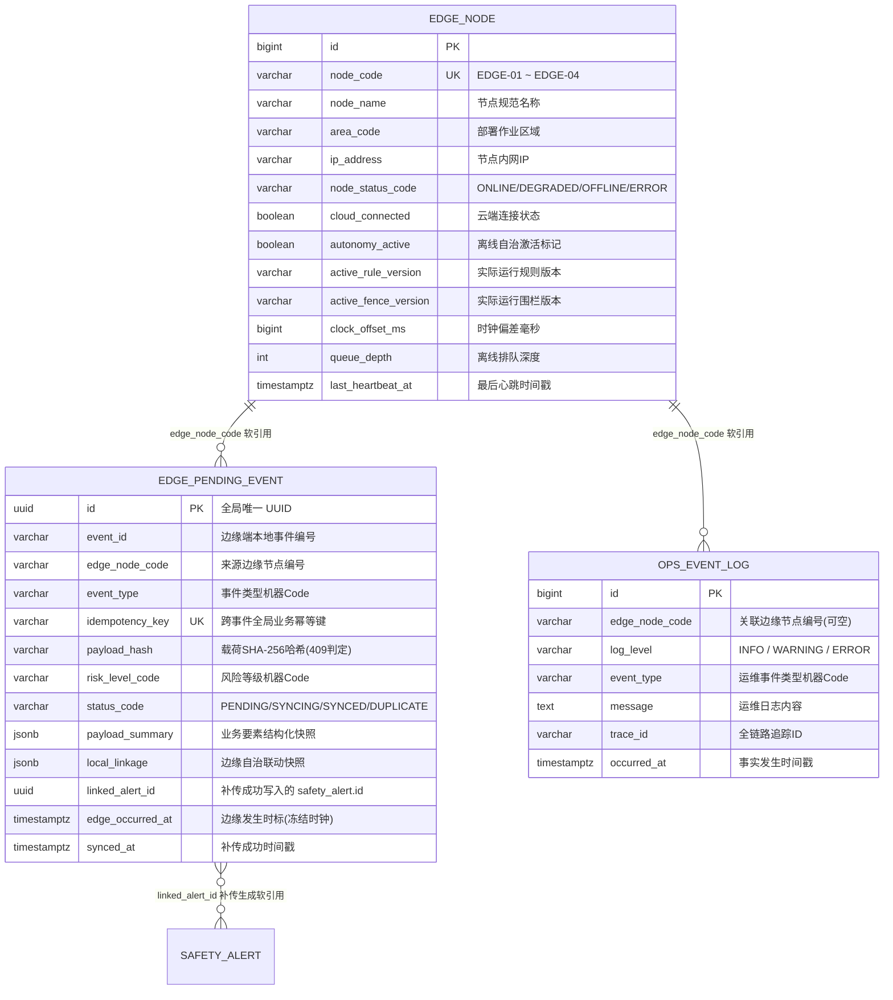

# 数据库 ER 关系图（openGauss 6.x 最终设计修订版）

> 只绘制持久化实体表（Master / Entity / Detail），**不绘制 Projection / DTO**（Overview / Screen / Analytics / Mobile / PairState / TrackPoint 等视图对象不建表）。
> 关系记号：`||--o{` 一对多；`||--||` 一对一；虚线表示应用层软引用（无数据库物理强外键）。
> 配套：[`database-design.md`](database-design.md)、[`openGauss-schema-final-draft.sql`](../../backend/src/main/resources/db/design/openGauss-schema-final-draft.sql)。

---

## 1. 主数据与现场人员资产域

---

## 2. 告警处置主聚合域（Alert Aggregate Cluster）

---

## 3. AI 视觉识别聚合域（AI Aggregate Cluster）

---

## 4. 防碰撞重点设备域（Collision Devices）

---

## 5. 电子围栏聚合域（Fence Aggregate Cluster）

---

## 6. 安全卡控规则聚合域（Rule Aggregate Cluster）

---

## 7. 边缘离线队列与运维审计域（Edge & Ops Logs）

